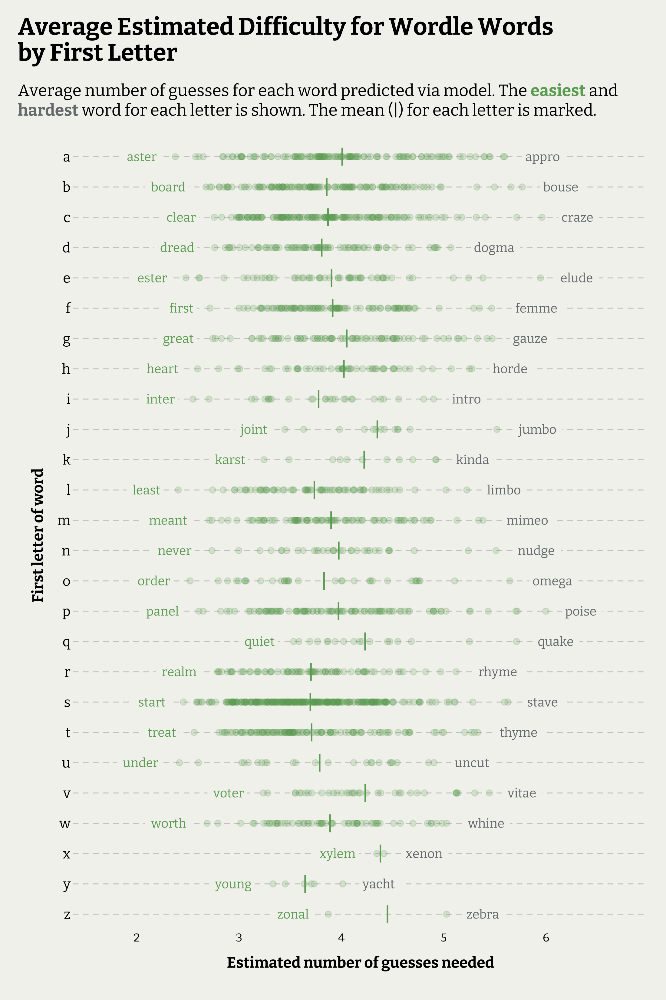

<script src="index_files/core-js/shim.min.js"></script>
<script src="index_files/react/react.min.js"></script>
<script src="index_files/react/react-dom.min.js"></script>
<script src="index_files/reactwidget/react-tools.js"></script>
<script src="index_files/htmlwidgets/htmlwidgets.js"></script>
<script src="index_files/reactable-binding/reactable.js"></script>
<script src="index_files/core-js/shim.min.js"></script>
<script src="index_files/react/react.min.js"></script>
<script src="index_files/react/react-dom.min.js"></script>
<script src="index_files/reactwidget/react-tools.js"></script>
<script src="index_files/htmlwidgets/htmlwidgets.js"></script>
<script src="index_files/reactable-binding/reactable.js"></script>
<script src="index_files/core-js/shim.min.js"></script>
<script src="index_files/react/react.min.js"></script>
<script src="index_files/react/react-dom.min.js"></script>
<script src="index_files/reactwidget/react-tools.js"></script>
<script src="index_files/htmlwidgets/htmlwidgets.js"></script>
<script src="index_files/reactable-binding/reactable.js"></script>
<script src="index_files/core-js/shim.min.js"></script>
<script src="index_files/react/react.min.js"></script>
<script src="index_files/react/react-dom.min.js"></script>
<script src="index_files/reactwidget/react-tools.js"></script>
<script src="index_files/htmlwidgets/htmlwidgets.js"></script>
<script src="index_files/reactable-binding/reactable.js"></script>

# Predicting the difficulty of Wordle words

## Introduction

In this post I want to give an example of modelling count data and building models based on text data. I was inspired to use the data set that Ivan Li scraped together for [his paper](https://github.com/Ivannoar/Twilight/blob/main/outputs/paper/paper.pdf). He scraped tweets daily over a 2 week period that mentioned ‘Wordle’ to help put together a sample of words and the number of guesses to get in correct, if successful. The full data is available [here](https://github.com/Ivannoar/Twilight/tree/main/inputs/data). I have downloaded and prepped a data set, and the code for doing this will be at the end of this post.

I also used a dictionary of allowed words for Wordle, created by Steve Kasice and available [here](https://github.com/steve-kasica/wordle-words/tree/master). This dictionary includes useful word prevalence data from Google Books corpus, which is a useful proxy for how commonly used (and therefore known) a word is, which may be useful to help predict a word’s difficulty.

From within this dictionary, I predicted the average number of guesses required for the top 20% most used words (1765 words in total). This was chosen as it was in line with the usage rankings of the sample words. Predicting words outside of this range would likely have produced odd results.

## Quick summary and conclusions

The predicted outcomes for the words are summarised in the graph below, split by starting letter. Unsurprisingly, words beginning with J, K, Q, V, and X had the highest number of guesses, on average, while words beginning with R, S, T, and Y were easier, on average.

The hardest words for each letter almost all ended with a vowel (particularly E), and often contain at least 3 vowels, in contrast to the least difficult words predicted.

Some predictions are hard to believe (i.e, I don’t believe many people would find “karst” or “aster” quick to guess), and point to the limits of having a small sample (only 14 words) to fit a model from.



The coefficients of the Poisson regression model used to make predictions are presented below. All predictors were found to be significant at the 95% confidence level. Full details of the values used as predictors (and how they were calculated) appear in the full post below. In summary, the model predicts:

- `ngram_score`: Words with higher scores have a more common structure of letters, so words with common structures have lower numbers of guesses on average.
- `usage_rank`: The more commonly used a word is in general, the lower number of guesses required on average.
- `pangrams_log`: The more 5-letter words you can make from the letters in a word (i.e. how many anagrams a word has), the lower the number of guesses, on average.
- `gap_score`: The higher this score is the less orthographically unique a word is. The less unique a word’s structure (For example, think how many words have the structure \*\*\_O_ER\*\*), the higher number of guesses on average.
- `ll_vowelTRUE`: If the word ends in a vowel, it has a higher number of guesses, on average.
- `n_vowels` : The number of vowels (aeiou) a word has. The more it has, the higher number of guesses it has, on average.

<div id="htmlwidget-1" class="reactable html-widget" style="width:auto;height:auto;"></div>
<script type="application/json" data-for="htmlwidget-1">{"x":{"tag":{"name":"Reactable","attribs":{"data":{"Term":["(Intercept)","ngram_score","usage_rank","pangrams_log","gap_score","ll_vowelTRUE","n_vowels"],"Estimate":[2.66818,-5.25947,-1.39931,-0.13755,29.66819,0.15346,0.03078],"Std. Error":[0.06844,0.44539,0.06373,0.00497,2.05413,0.00893,0.00715],"Statistic":[38.98351,-11.80872,-21.95717,-27.68112,14.44319,17.19172,4.30232],"p-value":[0,0,0,0,0,0,2e-05],"Significant":["*","*","*","*","*","*","*"]},"columns":[{"accessor":"Term","name":"Term","type":"character"},{"accessor":"Estimate","name":"Estimate","type":"numeric"},{"accessor":"Std. Error","name":"Std. Error","type":"numeric"},{"accessor":"Statistic","name":"Statistic","type":"numeric"},{"accessor":"p-value","name":"p-value","type":"numeric"},{"accessor":"Significant","name":"Significant","type":"character"}],"defaultPageSize":10,"paginationType":"numbers","showPageInfo":true,"minRows":1,"highlight":true,"striped":true,"style":{"fontFamily":["bitter","Arial"]},"dataKey":"a53429ee50ece38993efcd30f74f26f9","key":"a53429ee50ece38993efcd30f74f26f9"},"children":[]},"class":"reactR_markup"},"evals":[],"jsHooks":[]}</script>

## Method

The data I’ll be starting with looks like this:

``` r
glimpse(WORDLE)
```

    ## Rows: 38,878
    ## Columns: 9
    ## $ user_id        <dbl> 1.840251e+07, 2.827989e+09, 1.452768e+08, 1.075499e+18,…
    ## $ is_quote       <lgl> FALSE, FALSE, FALSE, FALSE, FALSE, FALSE, FALSE, FALSE,…
    ## $ is_retweet     <lgl> FALSE, FALSE, FALSE, FALSE, FALSE, FALSE, FALSE, FALSE,…
    ## $ wordle_raw     <chr> "Wordle 289 4/6", "Wordle 289 5/6", "Wordle 289 4/6", "…
    ## $ Hard           <lgl> TRUE, FALSE, TRUE, FALSE, FALSE, TRUE, TRUE, FALSE, TRU…
    ## $ wordle_id      <chr> "Wordle 289", "Wordle 289", "Wordle 289", "Wordle 289",…
    ## $ wordle_guesses <chr> "4", "5", "4", "5", "5", "5", "3", "3", "4", "3", "5", …
    ## $ wordle_fail    <lgl> FALSE, FALSE, FALSE, FALSE, FALSE, FALSE, FALSE, FALSE,…
    ## $ word           <chr> "shawl", "shawl", "shawl", "shawl", "shawl", "shawl", "…

The core information is the `word` itself (14 in total), the number of guesses the user took, and an indicator if they failed to guess the correct word within 6 tries. `Hard` mode indicator is also included.

The goal is to use this data set to fit a model that will predict the number of tries needed for the average person to correctly guess any legitimate Wordle word. You’ll notice that this original data set does not actually have any useful predictor variables inherently. To predict guesses, we will include minimal metadata about the word itself (e.g. level of common usage), but propose that word difficulty is associated with some combination of qualities inherent to the mix and order of letters within in it.

In this post I want to cover a few useful things. First, pre-processing text data using `tidymodels` recipes and and the `textrecipes` library. I’ll do this to cleanly take a 5-letter word and transform it into a matrix of numerical data about that word suitable for including in a prediction model. Secondly, I want to cover hurdle models, which are essentially two-step models for count data, where the first fitted model predicts the likelihood of a zero count (failure to guess the word in this example), and the second model predicts the count for non-zero outcomes. Lastly, I want to take our fitted model and use it to make predictions on new data, so we can see which words in the Wordle dictionary it thinks would be the easiest and hardest for players.

## Data exploration

Let’s have a quick explore of the data set before we start fitting models. First, lets check the split between regular players and hard-mode players.

``` r
table(WORDLE$Hard)
```

    ## 
    ## FALSE  TRUE 
    ##  7512 31366

There are many more Hard-mode answers than not, so let’s only work with the Hard mode results to remove this source of variation.

``` r
WORDLE <- WORDLE %>%
  filter(Hard == TRUE)
```

Let’s also check how many results we have for each word, the average number of guesses (and variance) for those who got it correct, and the proportion of players who failed to complete.

``` r
SUMMARY <- left_join(
  
  WORDLE %>%
    group_by(word) %>%
    summarise(N = n(),
              Pct_success = 100*mean(wordle_fail == FALSE)),
  
  WORDLE %>%
    filter(wordle_fail == FALSE) %>%
    mutate(wordle_guesses = as.numeric(wordle_guesses)) %>%
    group_by(word) %>%
    summarise(N_guesses = mean(wordle_guesses),
              Guess_var = var(wordle_guesses)),
  by = "word"
) 

SUMMARY %>%
  mutate(across(where(is.numeric), ~round(.x, digits = 2))) %>%
  reactable(striped = TRUE, defaultSorted = "N_guesses", defaultSortOrder = "desc",
            style = list(fontFamily = c("Helvetica", "Arial")))
```

<div id="htmlwidget-2" class="reactable html-widget" style="width:auto;height:auto;"></div>
<script type="application/json" data-for="htmlwidget-2">{"x":{"tag":{"name":"Reactable","attribs":{"data":{"word":["ample","black","cargo","comma","flair","foray","foyer","natal","olive","oxide","plant","scare","shawl","stair"],"N":[2313,2108,2383,2161,2238,2148,2599,2083,2502,2576,2204,2020,1940,2091],"Pct_success":[98.96,99.62,99.16,98.47,99.87,97.86,63.87,98.18,99.4,97.75,99.95,97.52,98.45,99.33],"N_guesses":[4.09,3.61,4.05,4.37,3.56,4.36,4.67,4.31,3.96,4.52,3.05,3.85,4.19,3.05],"Guess_var":[0.97,1.05,1.02,0.91,0.93,1.04,1.47,0.97,1.14,0.93,0.91,1.72,1.14,1.01]},"columns":[{"accessor":"word","name":"word","type":"character"},{"accessor":"N","name":"N","type":"numeric"},{"accessor":"Pct_success","name":"Pct_success","type":"numeric"},{"accessor":"N_guesses","name":"N_guesses","type":"numeric"},{"accessor":"Guess_var","name":"Guess_var","type":"numeric"}],"defaultSortDesc":true,"defaultSorted":[{"id":"N_guesses","desc":true}],"defaultPageSize":10,"paginationType":"numbers","showPageInfo":true,"minRows":1,"striped":true,"style":{"fontFamily":["Helvetica","Arial"]},"dataKey":"8e3de7c73b5c6981b91abff66709c2ad","key":"8e3de7c73b5c6981b91abff66709c2ad"},"children":[]},"class":"reactR_markup"},"evals":[],"jsHooks":[]}</script>

We have similar amounts of data for most words. The hardest word in the data was ‘foyer’, with an unusually low success rate, and the highest number of guesses for those that did succeed. The rest of the words have high success rates (comfortably over 95%).

Let’s check out the distribution of guesses across the data. The plot below shows most players are correct with 4 guesses. About 4% of players did not succeed (most of these will be from “foyer”). 0.67% of players guess the word immediately. This is likely highly inflated as people are motivated to share when they guess the word in one go - the theoretical chance of getting it correct in one turn is only 0.043%.

Since winning in one guess if overwhelmingly due to chance (or cheating!) we could consider removing these before fitting our model. There is some argument to be made that the probability of guessing in one would be higher for certain words due to them being more common or having a letter structure more similar to words people commonly choose as their first guess. However, I think these changes in probabilities would be tiny and hard to ascertain from an already small sample size of words. I also believe the same change in odds would already be captured by an increase in 2 guess wins.

``` r
w_Sum <- WORDLE %>%
  mutate(wordle_guesses = ifelse(wordle_fail == TRUE, "X", wordle_guesses)) %>%
  group_by(wordle_guesses) %>%
  summarise(n = n(),
            pct = paste0(round(100*(n()/nrow(WORDLE)), 2), "%")) %>%
  mutate(wordle_fail = ifelse(wordle_guesses == "X", TRUE, FALSE))

WORDLE %>%
  mutate(wordle_guesses = ifelse(wordle_fail == TRUE, "X", wordle_guesses)) %>%
  ggplot(aes(x = wordle_guesses, fill = wordle_fail)) +
  geom_bar(show.legend = FALSE) +
  geom_text(data = w_Sum, aes(x = wordle_guesses, y = n, label = pct, colour = wordle_fail), vjust = -1, size = 2.5, show.legend = FALSE) +
  scale_fill_manual(values = c(wGreen, wGrey)) +
  scale_colour_manual(values = c(wGreen, wGrey)) +
  labs(y = "Count of players",
       x = "Number of guesses")
```

}}index_files/figure-html/unnamed-chunk-7-1.png" width="1400" />

As expected, word with higher solve rates have lower number of guesses. The average number of guess appears negatively exponentially related to the change of success. Smaller changes in success rates closer to 100% are associated with bigger reductions in average guesses than changes closer to 0%. I’ve exponentiated the success rate to make the relationship linear.

``` r
SUMMARY %>%
  ggplot(aes(y = N_guesses, x = exp(Pct_success))) +
  geom_point(alpha = 0) +
  geom_smooth(method = "lm", formula = 'y ~ x', colour = wGrey) +
  geom_text(aes(label = word), colour = wGreen, family = "bitter") +
  labs(y = "Average number of guesses", x = "exp(Percent successful)")
```

}}index_files/figure-html/unnamed-chunk-8-1.png" width="1400" />

Finally, let’s have a quick review of average scores split by the letters in the word. The boxplot below shows that words with a ‘y’, ‘o’, ‘m’, ‘e’, or ‘f’ may be slightly harder. In this chart we can also see the limits of our data. We don’t have any words with the letters ‘j’, ‘q’, ‘u’ or ‘z’. We also only have single examples of words with ‘b’, ‘g’, ‘h’, ‘k’, ‘v’, ‘w’, and ‘x’.

``` r
SUMMARY_LETTERS <- str_split(SUMMARY$word, "", simplify = TRUE) %>%
  as_tibble(.name_repair = make.names) %>%
  setNames(., nm = paste0("Letter_", 1:5)) %>%
  mutate(word = SUMMARY$word) %>%
  left_join(., SUMMARY, by = "word") %>%
  pivot_longer(cols = starts_with("Letter_"), names_to = "Name", values_to = "Letter") 

SUMMARY_LETTERS %>%
  mutate(Letter = factor(Letter, levels = letters)) %>%
  ggplot(aes(x = Letter, y = N_guesses)) +
  geom_boxplot( fill = wGreen, colour = wGrey) +
  scale_x_discrete(drop = FALSE) +
  labs(y = "Average number of guesses", x = "Words containing letter...")
```

}}index_files/figure-html/unnamed-chunk-9-1.png" width="1400" />

The is a moderate relationship between how often a word is used and it’s average number of guesses.

``` r
DICT <- read.csv("wordle_words.csv") %>%
  mutate(usage_rank = percent_rank(occurrence)) %>%
  select(-day, -occurrence)


left_join(SUMMARY, DICT, by = "word") %>%
  ggplot(aes(x = usage_rank, y = N_guesses)) +
  geom_point(colour = wGreen, alpha = 0) +
  geom_smooth(colour = wGrey, method = "lm", formula = 'y ~ x') +
  geom_text(aes(label = word), colour = wGreen, family = "bitter") +
  labs(x = "Word usage score (percentile)",
       y = "Average number of guesses")
```

}}index_files/figure-html/unnamed-chunk-10-1.png" width="1400" />

The relationship between word usage rank and success rate is less strong, with the outlier ‘foyer’ skewing the result.

``` r
left_join(SUMMARY, DICT, by = "word") %>%
  ggplot(aes(x = usage_rank, y = Pct_success)) +
  geom_point(colour = wGreen, alpha = 0) +
  geom_smooth(colour = wGrey, method = "lm", formula = 'y ~ x') +
  geom_text(aes(label = word), colour = wYellow, family = "bitter") +
  labs(x = "Word usage score (percentile)",
       y = "Percent successful")
```

}}index_files/figure-html/unnamed-chunk-11-1.png" width="1400" />

Without ‘foyer’ the relationship does appear to linear, however it is not strong.

``` r
left_join(SUMMARY, DICT, by = "word") %>%
  filter(word != "foyer") %>%
  ggplot(aes(x = usage_rank, y = Pct_success)) +
  geom_point(colour = wGreen, alpha = 0) +
  geom_smooth(colour = wGrey, method = "lm", formula = 'y ~ x') +
  geom_text(aes(label = word), colour = wYellow) +
  labs(x = "Word usage score (percentile)",
       y = "Percent successful")
```

}}index_files/figure-html/unnamed-chunk-12-1.png" width="1400" />

## Fun with pieces of words

### N-grams for word characters

First, let’s use the unnest token functions from `tidytext` to create a score of how unusual the little ‘chunks’ of letters that make up each word are. The unnest shingles function will do this for us. You can see what it does to ‘oxide’ below. Since we know each word is 5 letters, we can easily incorporate position information into this index too. Each word will be made up of 7 bi- and tri- “shingles”. The rarity of those appearing will be different depending on the where in the word they are, for example ‘de’ will have different levels of occurrences depending on if it’s the first two letters, second two, and so on.

``` r
library(tidytext)

DICT %>%
  select(word) %>%
  filter(word == "oxide") %>%
  unnest_character_shingles(., letter, word, drop = FALSE, n = 3, n_min = 2) %>%
  mutate(position = row_number())
```

    ##    word letter position
    ## 1 oxide     ox        1
    ## 2 oxide    oxi        2
    ## 3 oxide     xi        3
    ## 4 oxide    xid        4
    ## 5 oxide     id        5
    ## 6 oxide    ide        6
    ## 7 oxide     de        7

Adding up the rarity of all the seven pieces of each word will give an indication of how unusual it is, structurally. Lower scores words are ones with more unique structures of letters than higher scoring words in this measure. We’ll refer to this as an n-gram score from here on.

We can see the words with the least rare combination of n-grams, and most unusual structure below. Words ending with ‘-er’ are the least unusual, while words like ‘awful’ and ‘ethyl’ have the most unusual structure of n-grams.

``` r
NGRAM_REF <- DICT %>%
  select(word) %>%
  unnest_character_shingles(., letter, word, drop = FALSE, n = 3, n_min = 2) %>%
  group_by(word) %>%
  mutate(letter = paste0(letter, "_", row_number())) %>%
  group_by(letter) %>%
  summarise(n = n_distinct(word),
            rarity = n/n_distinct(DICT$word))


NEW_DICT <- DICT %>%
  filter(usage_rank >= 0.8 | word %in% SUMMARY$word) %>%
  select(word) %>%
  unnest_character_shingles(., letter, word, drop = FALSE, n = 3, n_min = 2) %>%
  group_by(word) %>%
  mutate(letter = paste0(letter, "_", row_number())) %>%
  ungroup() %>%
  left_join(., NGRAM_REF, by = "letter") %>%
  select(-n) %>%
  group_by(word) %>%
  summarise(ngram_score = sum(rarity)) %>%
  left_join(., DICT, by = "word") %>%
  filter(str_detect(word, "s$", negate = TRUE) | str_detect(word, "ss$")) %>%
  filter(str_detect(word, "ed$", negate = TRUE))
  

bind_rows(
  NEW_DICT %>%
    slice_max(n = 5, order_by = ngram_score) %>%
    mutate(Rank = "Top 5"),
  
  NEW_DICT %>%
    slice_min(n = 5, order_by = ngram_score) %>%
    mutate(Rank = "Bottom 5")
)
```

    ## # A tibble: 10 × 4
    ##    word  ngram_score usage_rank Rank    
    ##    <chr>       <dbl>      <dbl> <chr>   
    ##  1 rarer     0.0889       0.823 Top 5   
    ##  2 paler     0.0806       0.840 Top 5   
    ##  3 mater     0.0797       0.842 Top 5   
    ##  4 liner     0.0774       0.901 Top 5   
    ##  5 miner     0.0774       0.877 Top 5   
    ##  6 ethyl     0.00385      0.898 Bottom 5
    ##  7 awful     0.00393      0.932 Bottom 5
    ##  8 epoxy     0.00432      0.895 Bottom 5
    ##  9 equip     0.00455      0.890 Bottom 5
    ## 10 enjoy     0.00486      0.969 Bottom 5

### Pangrams of words

We might also expect that the number of legal words that can be made from the combination of all the letters within a word (a pangram) may also be a factor in how difficult a word is to guess. Let’s get a count of the number of pangrams for each legal word and add it to the dictionary.

``` r
get_letters <- function(.x){str_split(.x, "", simplify = TRUE)[1,] %>% unique() %>% sort() %>% str_c(collapse = "")}

PANGRAM_REF <- DICT %>%
  select(word) %>%
  mutate(
    letters = map_chr(word, ~get_letters(.x))
  ) %>%
  group_by(letters) %>%
  summarise(pangrams_log = log(n()))

NEW_DICT <- NEW_DICT %>%
  mutate(letters = map_chr(word, ~get_letters(.x))) %>%
  left_join(., PANGRAM_REF, by = "letters") %>%
  select(-letters)
```

### Sets of letters with gaps

The last set of information we’ll extract is how common combinations of letters in words are, taking into account open spaces, e.g. **-O-ER** could become LOVER, LONER, GONER, BORER, etc.. I would expect getting stuck in this situation can increases the number of guesses required, which could explain **FOYER**’s unusually high failure rate.

We’ll call this the **gap score**, with higher scores indicating a word has a more common orthographic structure than word with lower scores.

``` r
GAP_REF <- DICT %>%
  select(word) %>%
  mutate(
    gap01011 = map_chr(word, ~str_c(str_split(.x, "", simplify = TRUE)[1, c(2,4,5)], collapse = "")),
    gap10101 = map_chr(word, ~str_c(str_split(.x, "", simplify = TRUE)[1, c(1,3,5)], collapse = "")),
    gap11001 = map_chr(word, ~str_c(str_split(.x, "", simplify = TRUE)[1, c(1,2,5)], collapse = "")),
    gap10011 = map_chr(word, ~str_c(str_split(.x, "", simplify = TRUE)[1, c(1,4,5)], collapse = "")),
    gap01101 = map_chr(word, ~str_c(str_split(.x, "", simplify = TRUE)[1, c(2,3,5)], collapse = ""))
  ) %>%
  pivot_longer(cols = starts_with("gap"), names_to = "pattern", values_to = "letters") %>%
  mutate(letters = paste0(letters, "_", pattern)) %>%
  group_by(letters) %>%
  summarise(n = n_distinct(word),
            rarity = n/n_distinct(DICT$word))


NEW_DICT <- NEW_DICT %>%
  select(word) %>%
  mutate(
    gap01011 = map_chr(word, ~str_c(str_split(.x, "", simplify = TRUE)[1, c(2,4,5)], collapse = "")),
    gap10101 = map_chr(word, ~str_c(str_split(.x, "", simplify = TRUE)[1, c(1,3,5)], collapse = "")),
    gap11001 = map_chr(word, ~str_c(str_split(.x, "", simplify = TRUE)[1, c(1,2,5)], collapse = "")),
    gap10011 = map_chr(word, ~str_c(str_split(.x, "", simplify = TRUE)[1, c(1,4,5)], collapse = "")),
    gap01101 = map_chr(word, ~str_c(str_split(.x, "", simplify = TRUE)[1, c(2,3,5)], collapse = ""))
  ) %>%
  pivot_longer(cols = starts_with("gap"), names_to = "pattern", values_to = "letters") %>%
  mutate(letters = paste0(letters, "_", pattern)) %>%
  left_join(., GAP_REF, by = "letters") %>%
  select(-n, -pattern, -letters) %>%
  group_by(word) %>%
  summarise(gap_score = sum(rarity)) %>%
  left_join(NEW_DICT, ., by = "word")
```

### Looking at these word scores for our words

The plots below show all these new word scores for our sample words regressed against both the average number of guesses taken, and the success rate.

There appears to be a positive relationship between how common a word’s orthographic structure (gap score) is and the average number of guesses, and negative relationships for average guesses and the (logged) number of pangrams a word has and its usage rank. The rarity of its ngram structure (`ngram_score`) is less strongly associated but appears slightly positive.

``` r
SUMMARY <- left_join(SUMMARY, NEW_DICT, by = "word")

SUMMARY %>%
  select(word, N_guesses, ngram_score:gap_score) %>%
  pivot_longer(cols = ngram_score:gap_score, names_to = "Metric", values_to = "Score") %>%
  ggplot(aes(x = Score, y = N_guesses)) +
  geom_point(alpha = 0) +
  geom_smooth(colour = wGrey, method = "lm", formula = 'y ~ x') +
  geom_text(aes(label = word), colour = wGreen, family = "bitter") +
  facet_wrap(Metric~., ncol = 2, scales = "free_x")
```

}}index_files/figure-html/unnamed-chunk-17-1.png" width="1400" />

Higher gap scores are associated with a lower success rate, and highe word usage is associated with a higher success rate, but other relationships are less clear.

``` r
SUMMARY %>%
  select(word, Pct_success, ngram_score:gap_score) %>%
  mutate(Pct_success = exp(Pct_success)) %>%
  pivot_longer(cols = ngram_score:gap_score, names_to = "Metric", values_to = "Score") %>%
  ggplot(aes(x = Score, y = Pct_success)) +
  geom_point(alpha = 0) +
  geom_smooth(colour = wGrey, method = "lm", formula = 'y ~ x') +
  geom_text(aes(label = word), colour = wYellow, family = "bitter") +
  facet_wrap(Metric~., ncol = 2, scales = "free_x")
```

}}index_files/figure-html/unnamed-chunk-18-1.png" width="1400" />

# Modelling average number of guesses

There are two aspects to a word’s difficulty for Wordle - first, the probability you’ll get it correct at all, and secondly, how many guesses it is expected to take if you do. This is different to usual problems we find with modelling count data. The failures can’t be counted as zeros (This would lower the average number of guesses for words with lower success rates), nor is it right to treat them as a higher number. Instead, we need to model both outcomes separately. The latter, average guesses given success, can be modelled with a Poisson or quasi-Poisson model, which is standard practice for modelling counts. We’ll do that first.

The former, success probability, will require a logit model. We’ll do that second if the first model indicates this is a useful predictor for estimating average number of guesses required.

## Model 1a - Poisson model with success rate

The key question we need to answer is if success rate is a significant predictor in estimating the average number of guesses needed for a word, given someone guesses it at all. We have success rates for our sample words, but we do not have this for predicting the difficulty of future words. We’ll determine if this is a use predictor variable, given all the other word information we have, first. If not, we can remove it, and predict expected counts for our new words without having to predict a success rate for them.

The results below indicate all

``` r
## prepare data for fitting

mDATA <- WORDLE %>%
  filter(wordle_fail == FALSE) %>%
  mutate(wordle_guesses = as.numeric(wordle_guesses)) %>%
  select(word, wordle_guesses) %>%
  left_join(., SUMMARY, by = "word") %>%
  select(-N, -Guess_var, -N_guesses) %>%
  mutate(Pct_success = exp(Pct_success))

## set model formula and processing

m1rec <- recipe(wordle_guesses ~ ., data = mDATA) %>%
  step_mutate(ll_vowel = str_detect(word, pattern = "[aeiou]$"), ## indicate if word ends in a vowel
              n_vowels = str_count(word, pattern = "[aeiou]")) %>% ## count number of vowels in word
  update_role(word, new_role = "id") %>%
  step_zv()

library(poissonreg)
m1mod <- poisson_reg() #by default uses glm engine

m1wf <- workflow() %>%
  add_recipe(m1rec) %>%
  add_model(m1mod)

m1fit <- m1wf %>%
  fit(data = mDATA)

m1fit %>%
  tidy() %>%
  mutate(signif = ifelse(p.value <= 0.05, "*", "ns")) %>%
  mutate(across(where(is.numeric), ~round(.x, digits = 4))) %>%
  reactable(striped = TRUE,
            style = list(fontFamily = c("Helvetica", "Arial")))
```

<div id="htmlwidget-3" class="reactable html-widget" style="width:auto;height:auto;"></div>
<script type="application/json" data-for="htmlwidget-3">{"x":{"tag":{"name":"Reactable","attribs":{"data":{"term":["(Intercept)","Pct_success","ngram_score","usage_rank","pangrams_log","gap_score","ll_vowelTRUE","n_vowels"],"estimate":[2.1562,-0,-3.2168,-0.7501,-0.1102,12.7491,0.0919,0.0325],"std.error":[0.0814,0,0.4787,0.0848,0.0054,2.518,0.0103,0.0071],"statistic":[26.4969,-11.5386,-6.7199,-8.8416,-20.2213,5.0632,8.8891,4.5463],"p.value":[0,0,0,0,0,0,0,0],"signif":["*","*","*","*","*","*","*","*"]},"columns":[{"accessor":"term","name":"term","type":"character"},{"accessor":"estimate","name":"estimate","type":"numeric"},{"accessor":"std.error","name":"std.error","type":"numeric"},{"accessor":"statistic","name":"statistic","type":"numeric"},{"accessor":"p.value","name":"p.value","type":"numeric"},{"accessor":"signif","name":"signif","type":"character"}],"defaultPageSize":10,"paginationType":"numbers","showPageInfo":true,"minRows":1,"striped":true,"style":{"fontFamily":["Helvetica","Arial"]},"dataKey":"e16c9b097afebd6e4fea1322187e819d","key":"e16c9b097afebd6e4fea1322187e819d"},"children":[]},"class":"reactR_markup"},"evals":[],"jsHooks":[]}</script>

``` r
mSUM <- m1fit %>%
  augment(mDATA) %>%
  select(word, .pred) %>%
  distinct() %>%
  left_join(., select(SUMMARY, word, N_guesses), by = "word") %>%
  mutate(SqError = (N_guesses - .pred)^2)

RMSE <- sqrt((sum(mSUM$SqError)/nrow(mSUM)))

mSUM %>%
  ggplot(aes(x = N_guesses, y = .pred)) +
  geom_abline() +
  geom_text(aes(label = word), colour = wGreen) +
  lims(x = c(2.5,5), y = c(2.5,5)) +
  annotate("text", label = paste0("RMSE = ", round(RMSE, 2)), x = 3, y = 5, hjust = 0, colour = wYellow)
```

}}index_files/figure-html/unnamed-chunk-20-1.png" width="1400" />

## Model 1b - Poisson model without success rate

``` r
## set model formula and processing

m2rec <- recipe(wordle_guesses ~ ., data = mDATA) %>%
  step_rm(Pct_success)  %>%
  step_mutate(ll_vowel = str_detect(word, pattern = "[aeiou]$"), ## indicate if word ends in a vowel
              n_vowels = str_count(word, pattern = "[aeiou]")) %>% ## count number of vowels in word
  update_role(word, new_role = "id") %>%
  step_zv()

m2mod <- poisson_reg() #by default uses glm engine

m2wf <- workflow() %>%
  add_recipe(m2rec) %>%
  add_model(m2mod)

m2fit <- m2wf %>%
  fit(data = mDATA)

m2fit %>%
  tidy() %>%
  mutate(signif = ifelse(p.value <= 0.05, "*", "ns")) %>%
  mutate(across(where(is.numeric), ~round(.x, digits = 4))) %>%
  reactable(striped = TRUE,
            style = list(fontFamily = c("Helvetica", "Arial")))
```

<div id="htmlwidget-4" class="reactable html-widget" style="width:auto;height:auto;"></div>
<script type="application/json" data-for="htmlwidget-4">{"x":{"tag":{"name":"Reactable","attribs":{"data":{"term":["(Intercept)","ngram_score","usage_rank","pangrams_log","gap_score","ll_vowelTRUE","n_vowels"],"estimate":[2.6682,-5.2595,-1.3993,-0.1375,29.6682,0.1535,0.0308],"std.error":[0.0684,0.4454,0.0637,0.005,2.0541,0.0089,0.0072],"statistic":[38.9835,-11.8087,-21.9572,-27.6811,14.4432,17.1917,4.3023],"p.value":[0,0,0,0,0,0,0],"signif":["*","*","*","*","*","*","*"]},"columns":[{"accessor":"term","name":"term","type":"character"},{"accessor":"estimate","name":"estimate","type":"numeric"},{"accessor":"std.error","name":"std.error","type":"numeric"},{"accessor":"statistic","name":"statistic","type":"numeric"},{"accessor":"p.value","name":"p.value","type":"numeric"},{"accessor":"signif","name":"signif","type":"character"}],"defaultPageSize":10,"paginationType":"numbers","showPageInfo":true,"minRows":1,"striped":true,"style":{"fontFamily":["Helvetica","Arial"]},"dataKey":"b384dc534238bfa7399a68a5dab7379b","key":"b384dc534238bfa7399a68a5dab7379b"},"children":[]},"class":"reactR_markup"},"evals":[],"jsHooks":[]}</script>

``` r
mSUM <- m2fit %>%
  augment(mDATA) %>%
  select(word, .pred) %>%
  distinct() %>%
  left_join(., select(SUMMARY, word, N_guesses), by = "word") %>%
  mutate(SqError = (N_guesses - .pred)^2)

RMSE <- sqrt((sum(mSUM$SqError)/nrow(mSUM)))

mSUM %>%
  ggplot(aes(x = N_guesses, y = .pred)) +
  geom_abline() +
  geom_text(aes(label = word), colour = wGreen) +
  lims(x = c(2.5,5), y = c(2.5,5)) +
  annotate("text", label = paste0("RMSE = ", round(RMSE, 2)), x = 3, y = 5, hjust = 0, colour = wYellow)
```

}}index_files/figure-html/unnamed-chunk-22-1.png" width="1400" />

Model 1b, without the success rate does not appear to be much less accurate than Model 1a is. The Chi-square test below indicates that success rate is a significant predictor for average guesses compared to a model without it.

``` r
anova(extract_fit_engine(m2fit), extract_fit_engine(m1fit), test = "Chisq")
```

    ## Analysis of Deviance Table
    ## 
    ## Model 1: ..y ~ ngram_score + usage_rank + pangrams_log + gap_score + ll_vowel + 
    ##     n_vowels
    ## Model 2: ..y ~ Pct_success + ngram_score + usage_rank + pangrams_log + 
    ##     gap_score + ll_vowel + n_vowels
    ##   Resid. Df Resid. Dev Df Deviance  Pr(>Chi)    
    ## 1     30080     8736.4                          
    ## 2     30079     8602.5  1   133.91 < 2.2e-16 ***
    ## ---
    ## Signif. codes:  0 '***' 0.001 '**' 0.01 '*' 0.05 '.' 0.1 ' ' 1

Both models also pass a goodness-of-fit test based on their residual deviance as the p-value from a Chi-square test is not significant (not below 0.05).

``` r
bind_rows(
  glance(m1fit),
  glance(m2fit)
) %>%
  mutate(
    MODEL = c("Model 1a", "Model 1b")
  ) %>%
  mutate(chi.sq.p = pchisq(deviance, df.residual, lower.tail = FALSE)) %>% ## goodness of fit test based on residual deviance
  select(-logLik, nobs, df.null, null.deviance)
```

    ## # A tibble: 2 × 9
    ##   null.deviance df.null     AIC    BIC deviance df.residual  nobs MODEL chi.sq.p
    ##           <dbl>   <int>   <dbl>  <dbl>    <dbl>       <int> <int> <chr>    <dbl>
    ## 1        10274.   30086 105365. 1.05e5    8602.       30079 30087 Mode…        1
    ## 2        10274.   30086 105497. 1.06e5    8736.       30080 30087 Mode…        1

However, predictions made from this model will require imputed values for success rate as these are unknown for future words. This imputation introduces error into the predictions itself (unless the prediction model for success rate is impressively accurate), which would likely erase the accuracy gains made from including it in the first place. Therefore, I think it is better to work with model 1b, and predict expected average guesses for future words using known information about the word rather than imputed information.

Let’s confirm this with one more test. The exploration above only looks at how the models performed using all the sample words, so we expect it to fit better than we would on new words given it has ‘seen’ these words before. It would be helpful to get some idea of how the different models perform on words it hasn’t seen. Our sample it much too small for a traditional training/testing split, so we’ll use leave-one-out (LOO) cross validation.

### Leave-One-Out (LOO) Cross Validation

The method and logic behind LOO CV is fairly intuitive - we create a sample of our data with one word removed, so that we have one sample set missing each word, then fit our model to each of these samples. We then predict the average guesses for the word we withheld and compare the model’s prediction to the known average and collect the results for each withheld word in our data. This will give us an idea of how robust our models are to training data, and how well they are capable of generalising to words they haven’t seen before.

``` r
LOO_data <- vector("list", length = nrow(SUMMARY))

for(i in seq_along(SUMMARY$word)) {
  
  # for each word in sample
  # get sample data without that word
  DATA <- mDATA %>%
    filter(word != SUMMARY$word[i])
  
  #fit the model without that word
  FIT <- m1wf %>%
    fit(data = DATA)
  
  SUM <- SUMMARY %>%
    filter(word == SUMMARY$word[i]) %>%
    select(word, N_guesses, Pct_success, ngram_score:gap_score)
  
  SUM$.pred <- SUMMARY %>%
    filter(word == SUMMARY$word[i]) %>%
    select(word, Pct_success, ngram_score:gap_score) %>%
    predict(FIT, new_data = .) %>%
    pull()
  
  LOO_data[[i]] <- SUM
}

LOO_data <- LOO_data %>%
  bind_rows() %>%
  mutate(SqErr = (N_guesses - .pred)^2)


RMSE <- sqrt(sum(LOO_data$SqErr)/nrow(LOO_data))
```

``` r
LOO_data %>%
  ggplot(aes(y = sqrt(SqErr), x = "Word")) +
  geom_point() +
  geom_text(aes(x = "Word", label = word), hjust = -2, colour = wGreen) +
  geom_boxplot(width = 0.1, alpha = 0.3, fill = wYellow, colour = wGrey) +
  annotate("text", label = paste0("RMSE = ", round(RMSE, 2)), x = -Inf, y = Inf, vjust = 2, hjust = -0.5, colour = wYellow) +
  labs(title = "LOO Cross Validation results for Model 1a\n(with Success Rate)",
       y = "Absolute Error", 
       x = NULL)
```

}}index_files/figure-html/unnamed-chunk-26-1.png" width="1400" />

Most of the time, model 1a is within half a guess of being correct, however for the two easiest words (stair and plant), it was out by almost a whole guess.

``` r
LOO_data <- vector("list", length = nrow(SUMMARY))

for(i in seq_along(SUMMARY$word)) {
  
  # for each word in sample
  # get sample data without that word
  DATA <- mDATA %>%
    filter(word != SUMMARY$word[i])
  
  #fit the model without that word
  FIT <- m2wf %>%
    fit(data = DATA)
  
  SUM <- SUMMARY %>%
    filter(word == SUMMARY$word[i]) %>%
    select(word, N_guesses, Pct_success, ngram_score:gap_score)
  
  SUM$.pred <- SUMMARY %>%
    filter(word == SUMMARY$word[i]) %>%
    select(word, Pct_success, ngram_score:gap_score) %>%
    predict(FIT, new_data = .) %>%
    pull()
  
  LOO_data[[i]] <- SUM
}

LOO_data <- LOO_data %>%
  bind_rows() %>%
  mutate(SqErr = (N_guesses - .pred)^2)


RMSE <- sqrt(sum(LOO_data$SqErr)/nrow(LOO_data))
```

``` r
LOO_data %>%
  ggplot(aes(y = sqrt(SqErr), x = "Word")) +
  geom_point() +
  geom_text(aes(x = "Word", label = word), hjust = -2, colour = wGreen) +
  geom_boxplot(width = 0.1, alpha = 0.3, fill = wYellow, colour = wGrey) +
  annotate("text", label = paste0("RMSE = ", round(RMSE, 2)), x = -Inf, y = Inf, vjust = 2, hjust = -0.5, colour = wYellow) +
  labs(title = "LOO Cross Validation results for Model 1b\n(without Success Rate)",
       y = "Absolute Error", 
       x = NULL)
```

}}index_files/figure-html/unnamed-chunk-28-1.png" width="1400" />

Model 1b (without success rate) is a better performer in this regard. For the vast majority of words it hadn’t seen before it was still within half a guess (0.5) of being correct. The two words it was most wrong on (oxide and olive) have similar structures – both have the *O_I_E* pattern – which could indicate more information is needed for this or similar structures. We’ll stick with this simpler model and predict the average counts for our new words.

``` r
## redo model without reference to Pct_success variable
mDATA <- mDATA %>%
  select(-Pct_success)

m2rec <- recipe(wordle_guesses ~ ., data = mDATA) %>%
  step_mutate(ll_vowel = str_detect(word, pattern = "[aeiou]$"),
              n_vowels = str_count(word, pattern = "[aeiou]")) %>%
  update_role(word, new_role = "id") %>%
  step_zv()

m2wf <- workflow() %>%
  add_recipe(m2rec) %>%
  add_model(m2mod)

m2fit <- m2wf %>%
  fit(data = mDATA)
```

## Ranking Potential Wordle words by Difficulty

``` r
library(ggtext)

NEW_DICT <- bind_cols(
  NEW_DICT,
  predict(m2fit, new_data = NEW_DICT))


NEW_DICT <- NEW_DICT %>%
  mutate(first_letter = str_extract(word, "^.")) %>%
  filter(str_detect(word, "s$", negate = TRUE) | str_detect(word, "ss$"))

pDATA <- NEW_DICT %>%
  group_by(first_letter) %>%
  summarise(N = n(),
            mean = mean(.pred),
            max_diff = max(.pred),
            min_diff = min(.pred)) %>%
  left_join(.,
            NEW_DICT %>% group_by(first_letter) %>%
              slice_max(order_by = .pred, n = 1) %>%
              select(first_letter, word) %>%
              rename("hard_word" = "word")) %>%
  left_join(.,
            NEW_DICT %>%
              group_by(first_letter) %>%
              slice_min(order_by = .pred, n = 1) %>%
              select(first_letter, word, .pred) %>%
              rename(c("easy_word" = "word", "min_lab" = ".pred")))

pDATA %>%
  ggplot(aes(y = first_letter)) +
  geom_segment(aes(yend = first_letter, x = min_diff, xend = max_diff), lineend = "round", linewidth = 3, alpha = 0, colour = wGreen) +
  geom_point(data = NEW_DICT, aes(x = .pred, y = first_letter), size = 2, alpha = 0.2, colour = wGreen, shape = 19) +
  geom_point(aes(x = mean), shape = "|", size = 5, colour = wGreen) +
  geom_label(aes(x = max_diff, label = hard_word), size = 3.5, hjust = -0.4, colour = wGrey, family = "bitter", fill = "#F3F3EE", label.size = NA) +
  geom_label(aes(x = min_lab, label = easy_word), size = 3.5, hjust = 1.4, colour = wGreen, family = "bitter", fill = "#F3F3EE", label.size = NA) +
  scale_y_discrete(limits = rev) +
  scale_x_continuous(expand = expansion(add = 1)) +
  labs(title = "Average Estimated Difficulty for Wordle Words\nby First Letter",
       subtitle = "Average number of guesses for each word predicted via model. The <span style = 'color:#6ca965;'>**easiest**</span> and <span style = 'color:#787c7f;'>**hardest**</span> word for each letter is shown. The mean (|) for each letter is marked.",
       x = "Estimated number of guesses needed",
       y = "First letter of word") +
  theme(panel.grid.major.y = element_line(colour = "grey80", linetype = "dashed"),
        plot.title = element_text(margin = margin(b = 15)),
        plot.subtitle = element_textbox_simple(face = "plain", margin = margin(b = 15)))
```

}}index_files/figure-html/unnamed-chunk-30-1.png" width="1400" />

One last interesting thing to do is to see how our sample words compare to the words we predicted the difficulty for. The model can be most trusted for predicting results for words with similar values of the predictors we used to the words in our sample. Since our sample is small, it is unlikely to have covered much of the possible “space” that all Wordle words could cover. It is important when fitting and using predictive models to understand this and be wary of predictions for outcomes in situations where your new predictors are very different from anything in your sample.

We can visualise this using dimensionality reduction. The plot below shows all the words plotted over their first 2 PCA dimensions, reduced from the predictor values in the model (excluding the last letter vowel indicator, as PCA does not handle Boolean indicators properly). We can see our sample words only cover a small part of the total ‘space’ in this regard. The words with the lowest number of guesses predicted (in blue) are sitting together near “scare” but otherwise outside of where mot sample words are.

We can also see that many of the words with the highest number of guesses (the points in white and yellow) are sitting together to the left of the plot, in a space where we have no sample words. This is a useful visualisation of the limits of small samples sizes.

``` r
dict_pc <- NEW_DICT %>%
    mutate(ll_vowel = str_detect(word, pattern = "[aeiou]$"),
              n_vowels = str_count(word, pattern = "[aeiou]")) %>%
  select(ngram_score:gap_score, n_vowels)

pc <- bind_cols(
  select(NEW_DICT, word, .pred) ,
  prcomp(dict_pc, scale. = TRUE)$x)

pc %>%
  ggplot(aes(x = PC1, y = PC2, colour = .pred)) +
  geom_point() +
  geom_text(data = filter(pc, word %in% SUMMARY$word), aes(label = word), colour = "black", alpha = 0.8, family = "bitter") +
  geom_text(data = filter(pc, .pred >= 6), aes(label = word), colour = "firebrick4", family = "bitter") +
  geom_text(data = filter(pc, .pred <= 2.5), aes(label = word), colour = "dodgerblue3", family = "bitter") +
  scale_colour_gradient2(midpoint = 4, mid = "grey90", high = wYellow, low = wGreen)  +
  labs(title = "Comparison of sample words to all words in\nour Wordle dictionary",
       subtitle = str_wrap("This plot shows the words in our sample in 2-dimensional space compared to all the words we predicted the average number of guesses for. Words in red had predictions higher than 6 (which is not a possible average). Words in blue had an average guess less than 2.5 (notably lower than any in our sample)", 70),
       color = "Predicted number\nof guesses") +
  theme(legend.title = element_text(size = 11))
```

}}index_files/figure-html/unnamed-chunk-31-1.png" width="1400" />

## Appendix

### Code for getting Wordle data

``` r
library(tidyverse)

DATES <- c(4:10, 17:23)
URLS <- paste0("https://raw.githubusercontent.com/Ivannoar/Twilight/main/inputs/data/april_", DATES, ".csv")

RAW <- map(URLS, ~read.csv(file = .x, stringsAsFactors = FALSE, fileEncoding = "latin1") %>% select(user_id, text, is_quote, is_retweet) %>%
             filter(is_quote == FALSE & is_retweet == FALSE))

WORDLE <- RAW %>%
  bind_rows() %>%
  mutate(wordle_raw = str_extract(text, pattern = "Wordle [[:digit:]]{3} .\\/6.")) %>%
  filter(!is.na(wordle_raw)) %>%
  mutate(Hard = str_detect(wordle_raw, pattern = "\\*$")) %>%
  mutate(wordle_raw = str_remove(wordle_raw, pattern = "\\*$") %>% str_squish(.),
         wordle_id = str_extract(wordle_raw, "Wordle [[:digit:]]{3}"),
         wordle_guesses = str_extract(wordle_raw, ".(?=\\/6)"),
         wordle_fail = str_detect(wordle_guesses, "[[:digit:]]", negate = TRUE)) %>%
  filter(!str_detect(wordle_id, "287|296|297|309"))

WORDS <- tibble(
  wordle_id = sort(unique(WORDLE$wordle_id)),
  word = c("shawl", "natal", "comma", "foray", "scare", "stair", "black", "ample", "flair", "foyer", "cargo", "oxide", "plant", "olive")
)

WORDLE <- WORDLE %>%
  left_join(., WORDS, by = "wordle_id")


write.csv(WORDLE, "wordle_results.csv", row.names = FALSE)
```
