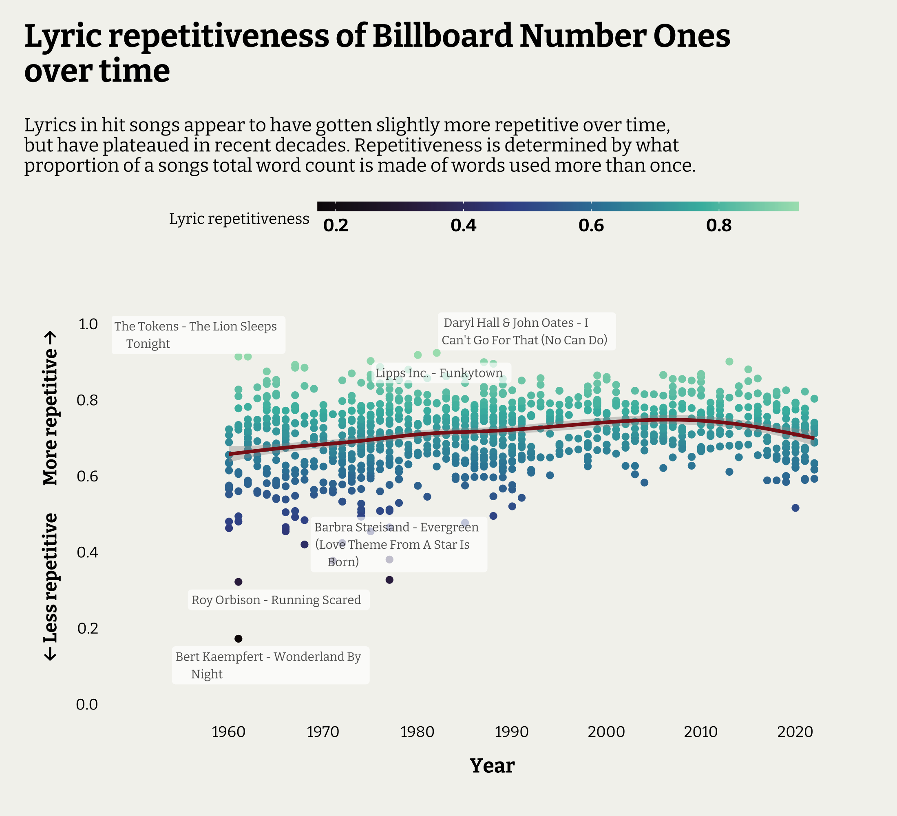

```{r, include=FALSE}
knitr::opts_chunk$set(echo = TRUE, warning = FALSE, message = FALSE, fig.asp = 0.7, dpi = 200, fig.retina = 2, fig.showtext = TRUE)

library(tidyverse)
library(reactable)
library(showtext)

font_add_google("Bitter", "bitter", regular.wt = 400, bold.wt = 700)
showtext_auto()
showtext_opts(dpi = 250)

# graph theme set ####
theme_set(theme_void() +
            theme(plot.background = element_rect(fill = "#F3F3EE", colour = "#F3F3EE"),
                  plot.margin = unit(c(0.5, 0.5, 0.5, 0.5), "cm"),
                  text = element_text(size = 13, family = "bitter"),
                  plot.title = element_text(family = "bitter", face = "bold", size = 19, margin = margin(b = 12)),
                  plot.title.position = "plot",
                  plot.subtitle = element_text(face = "bold", margin = margin(1,1,10,1)),
                  legend.position = "top",
                  legend.title = element_text(),
                  legend.box.margin = margin(b = 10, r = 10),
                  legend.text = element_text(face = "bold", margin = margin(l = -0.8, r = 0.5, unit = "cm")),
                  legend.key.width = unit(2, "cm"),
                  legend.key.height = unit(0.9, "cm"),
                  axis.title = element_text(size = 12, face = "bold", margin = margin(10,10,10,10)),
                  axis.title.y = element_text(angle = 90),
                  axis.text.y.right = element_text(size = 0),
                  axis.text.y = element_text(size = 11, hjust = 1, margin = margin(r = 2)),
                  axis.text.x = element_text(size = 9, hjust = 0.5),
                  panel.spacing.y = unit(0.5, "cm"),
                  strip.text = element_text(size = 14, colour = "grey30", family = "bitter", face = "bold", margin = margin(b=3)),
                  strip.background = element_blank()))


SONGS <- read.csv("Billboard_Hits_GeniusIDs.csv")
BBOARD <- read.csv("Billboard_Number1_1960_2022.csv")
LYRICS <- read.csv("BillboardHits_songLyrics.csv")
  
```

## Introduction

In this quick post I want to quickly explore the song lyrics from Billboard number 1 hits that I scraped together using Wikipedia and the Genius API. I won't get into the web scraping process, but was able to assemble data on the songs and their lyrics for most of the number one hits from 1960 to the end of 2022. The R code will be in my Github folder for this post. 

There's a million things we could do with text data like this, but let's narrow it down to a couple of key questions:

* **Have song lyrics gotten more repetitive over time?**
* **Is this still true when you account for the song's genre?**

## Quick summary and conclusion

The plot below shows the shows repetitiveness scores over time. The smoothed average shows a slight increase in repetition over the years, flattening out in the 2000s. However, variation in song repetition is larger in the earlier years, with a few clear outliers in the 60s that have very little lyric repetition.



A linear regression model did find that as Year increased, lyric repetition did, on average, increase slightly, after accounting for the changes in Genre popularity over time. A second model that included the word counts of the song lyrics confirmed that the song length was a much better explanation for changes in repetition.

## Method

First let's read in the data. I had the information stored on 3 files, so we'll need to join the together and keep the variables we want. The data has each song's name, the artist, the year and decade it was number one, song ID and genre tags from Genius, the number of word's in its lyrics, and the lyrics themselves. We can say that lyrics did get slightly more repetitive over time, which was due to hit songs becoming longer and wordier. As average song lengths move over time, we can expect lyric repetition to move with them.

```{r}
DATA <- left_join(
  select(BBOARD, Year:Artist_s), SONGS, by = 
) %>%
  left_join(., LYRICS, by = "song_id") %>%
  select(Year, Decade, Song, Artist, song_id, song_genre, lyric_count, song_lyrics )

head(DATA)
```

We are more likely to be missing lyrics for song from the 60s, and much less likely to be missing data from more recent songs. This is not ideal --  we'd prefer this missing data to be evenly spread -- but we still have at least 100 songs from each decade (except the 2020s), and we can assume that not being able to find the lyrics to a song is independent to the content of the lyrics itself which is what we are interested in.

```{r}
left_join(
  DATA %>%
  group_by(Decade) %>%
  summarise(n_hits = n_distinct(Song)),
  
  DATA %>%
  filter(is.na(song_id)) %>%
  group_by(Decade) %>%
  summarise(n_missing = n()),
  by = "Decade"
  ) %>%
  mutate(Prop_missing = n_missing/n_hits)
```

We have song genre tags from Genius too, which we can use as an additional grouping variable. Let's extract those out and see how many categories there are. The first tag is always from one of the major Genius genre categories, with additional sub-genre tags after this. We only want the major category for our analysis.

```{r}
## Remove songs without lyrics or tags or words
HITS <- DATA %>%
  filter(!is.na(song_id) & !is.na(song_lyrics) & lyric_count > 0) %>%
  mutate(Genre = word(song_genre, 1, 1, sep = stringr::fixed("_")) %>% str_to_title())

HITS %>%
  group_by(Genre) %>%
  summarise(n = n())

```

Looks like there are only 6 major genres, with Country and Non-Music being small. Non-music is the song 'Theme from a Summer Place', a film soundtrack that became popular in 1960. Let's lump them into "Other" for when we exploring results by genre.

```{r}
HITS <- HITS %>%
  mutate(Genre = fct_lump_n(Genre, n = 4, other_level = "Other"))
```

We need to unnest the lyrics into tokens so we can calculate how repetitive a song is (what proportion of its words are used multiple times). First, the lyrics include some meta-information in square and curly brackets -- e.g. "[Verse 1]" -- that need to be removed.

Then we'll unnest the song lyrics so we have a large data frame with each word from each song on a row.

```{r}

HITS <- HITS %>%
  mutate(song_lyrics = str_remove_all(song_lyrics, "\\[[^\\]]*\\]|\\{[^\\]]*\\}") %>% str_squish())

library(tidytext)
TOKENS <- HITS %>%
  unnest_tokens(output = "token", input = "song_lyrics")

head(TOKENS)
```

Perfect! Let's look at a couple of interesting things before moving on to repetitiveness.

Have word choices changed over time? What are the most used words (words that appear in the most songs) for each decade. We'll use a stop list of uninteresting words to filter these out.

The results are plotted below. We clearly enjoy love songs, although use of the word 'love' itself has dropped in recent decades. Songs about our babies continue to be popular, and you can't go round with a few 'yeahs' in your song.

```{r, fig.asp=0.9}
STOP <- stop_words %>% filter(lexicon == "SMART")

TOKENS %>%
  filter(!token %in% STOP$word) %>%
  group_by(Decade, token) %>%
  summarise(N_songs = n_distinct(song_id), .groups = "drop_last") %>%
  slice_max(order_by = N_songs, n = 5) %>%
  left_join(., 
            HITS %>%
              group_by(Decade) %>%
              summarise(N_decade = n_distinct(song_id)), by = "Decade") %>%
  mutate(Pct = paste0(round(100*(N_songs/N_decade), 1), "%"),
         token2 = reorder_within(token, N_songs, Decade)) %>%
  ggplot(aes(y = token2)) +
  geom_col(aes(x = N_decade), fill = "grey80") +
  geom_col(aes(x = N_songs, fill = token)) +
  geom_text(aes(x = N_songs, colour = token, label = Pct), hjust = -0.15, size = 3, family = "bitter") +
  scale_y_reordered() +
  scale_fill_viridis_d(option = "mako", end = 0.6, begin = 0.1) +
  scale_colour_viridis_d(option = "mako", end = 0.6, begin = 0.1) +
  labs(title = "Most used words in Number 1 hits by decade",
       x = "Number of songs used in",
       y = "Word") +
  facet_wrap(Decade~., ncol = 4, scales = "free_y") +
  theme(legend.position = "none")
```


What about by genre? Not much difference, though we have our 'oohs' in R&B songs, and no love in Rap songs (but a lot of babies).

```{r, fig.asp = 0.9}
TOKENS %>%
  filter(!token %in% STOP$word) %>%
  group_by(Genre, token) %>%
  summarise(N_songs = n_distinct(song_id), .groups = "drop_last") %>%
  slice_max(order_by = N_songs, n = 5) %>%
  left_join(., 
            HITS %>%
              group_by(Genre) %>%
              summarise(N_genre = n_distinct(song_id)), by = "Genre") %>%
  mutate(Pct = paste0(round(100*(N_songs/N_genre), 1), "%"),
         token2 = reorder_within(token, N_songs, Genre)) %>%
  ggplot(aes(y = token2)) +
  geom_col(aes(x = N_genre), fill = "grey80") +
  geom_col(aes(x = N_songs, fill = token)) +
  geom_text(aes(x = N_songs, colour = token, label = Pct), hjust = -0.15, size = 3, family = "bitter") +
  scale_y_reordered() +
  scale_fill_viridis_d(option = "mako", end = 0.6, begin = 0.1) +
  scale_colour_viridis_d(option = "mako", end = 0.6, begin = 0.1) +
  labs(title = "Most used words in Number 1 hits by genre",
       x = "Number of songs used in",
       y = "Word") +
  facet_wrap(Genre~., ncol = 3, scales = "free_y") +
  theme(legend.position = "none")
```

### Repetitiveness

Let's get back on track. We'll judge a track repetitiveness by what proportion of it's total word count is words used more than once. In a song where every word is repeated, this would be 1. In a song where every word sang is completely unique, this would be 0.

The plot below shows the shows repetitiveness scores over time. The smoothed average shows a slight increase in repetition over the years, flattening out in the 2000s. However, variation in song repetition is larger in the earlier years, with a few clear outliers in the 60s that have very little lyric repetition.

```{r, fig.asp = 0.8}
library(ggrepel)

REP <- TOKENS %>%
  group_by(song_id, lyric_count) %>%
  summarise(n_unique = n_distinct(token), .groups = "drop") %>%
  mutate(repetitiveness = 1 - (n_unique/lyric_count)) %>%
  select(song_id, repetitiveness)

REP <- HITS %>%
  left_join(., REP, by = "song_id")

LABELS <- bind_rows(
  
  REP %>%
    distinct(Song, Artist, repetitiveness, .keep_all = TRUE) %>%
    slice_max(order_by = repetitiveness, n = 3),
  REP %>%
    distinct(Song, Artist, repetitiveness, .keep_all = TRUE) %>%
    slice_min(order_by = repetitiveness, n = 3)
)

REP %>%
  ggplot(aes(x = Year, y = repetitiveness)) +
  geom_point(aes(colour = repetitiveness)) +
  geom_smooth(colour = "firebrick4") +
  geom_label_repel(data = LABELS, aes(label = str_wrap(paste0(Artist, " - ", Song), 30)), size = 2.5, hjust = 0.1, family = "bitter", colour = "black", label.size = NA, alpha = 0.7) +
  scale_y_continuous(expand = expansion(mult = 0.3), breaks = c(0, 0.2, 0.4, 0.6, 0.8, 1)) +
  scale_x_continuous(expand = expansion(mult = c(0.2, 0.1)), breaks = c(1960, 1970, 1980, 1990, 2000, 2010, 2020)) +
  scale_colour_viridis_c(option = "mako", end = 0.9) +
  labs(title = "Lyric repetitiveness of Billboard Number Ones\nover time",
       subtitle = str_wrap("Lyrics in hit songs appear to have gotten slightly more repetitive over time, but have plateaued in recent decades. Repetitiveness is determined by what proportion of a songs total word count is made of words used more than once."),
       colour = "Lyric repetitiveness",
       y = "\u2190 Less repetitive        More repetitive \u2192") +
  theme(axis.title.y = element_text(size = 11),
        axis.text.y = element_text(size = 9, margin = margin(r= 8)),
        plot.subtitle = element_text(face = "plain", size = 11, margin = margin(b= 15, t = 5)),
        legend.title = element_text(size = 9),
        legend.margin = margin(b = 3),
        legend.key.height = unit(0.2, "cm"))


```

### Analysing results with a linear model

We looked at the plot as said it appeared that repetitiveness is increasing over time. Let's use a linear regression model to see year is a significant predictor for repetitiveness. We might also be able to account for why this is.

The results from a model to predict repetitiveness by Genre and Year is shown below. It shows that Year is a significant predictor after accounting for Genre. Every year you can expect a very small (0.001) increase in the average lyric repetitiveness. However, with an adjusted R^2^ of 0.075, this model isn't explaining a lot of the variation in repetitiveness.

```{r}
library(tidymodels)

model1 <- lm(repetitiveness ~ Genre + Year, data = REP)
summary(model1)
```

I want to highlight two relationships. First, that a song's repetitiveness tends to increase as its total word count goes up, to a certain point. Second, that songs total word counts have been increasing over time, plateauing in the 2000s and coming down a little recently. This is the exact same pattern seen in overall repetitiveness, which may be explained best the changes in song lengths over time.

```{r}
ggplot(data = REP, aes(x = lyric_count, y = repetitiveness)) +
  geom_point() +
  geom_smooth(method = "loess", colour = "firebrick4")

ggplot(data = REP, aes(x = Year, y = lyric_count)) +
  geom_point() +
  geom_smooth(method = "loess", colour = "firebrick4")
```

We'll fit a second model that includes a song's lyric count and view the results below. We can see that after adding in the lyric count, year is no longer a significant predictor.

```{r}
model2 <- lm(repetitiveness ~ Genre + lyric_count + Year, data = REP)
summary(model2)
```

We can compare the models too. The second model, with lyric word count, has a lower AIC, less deviance, and account for much more variation in repetitiveness (`adj.r.squared`) than the first model. It's simply explaining the variation much better than Year did. So we can say that lyrics did get slightly more repetitive over time, which was due to hit songs becoming longer and wordier. As average song lengths move over time, we can expect lyric repetition to move with them.

```{r}
bind_rows(glance(model1), glance(model2))
```


