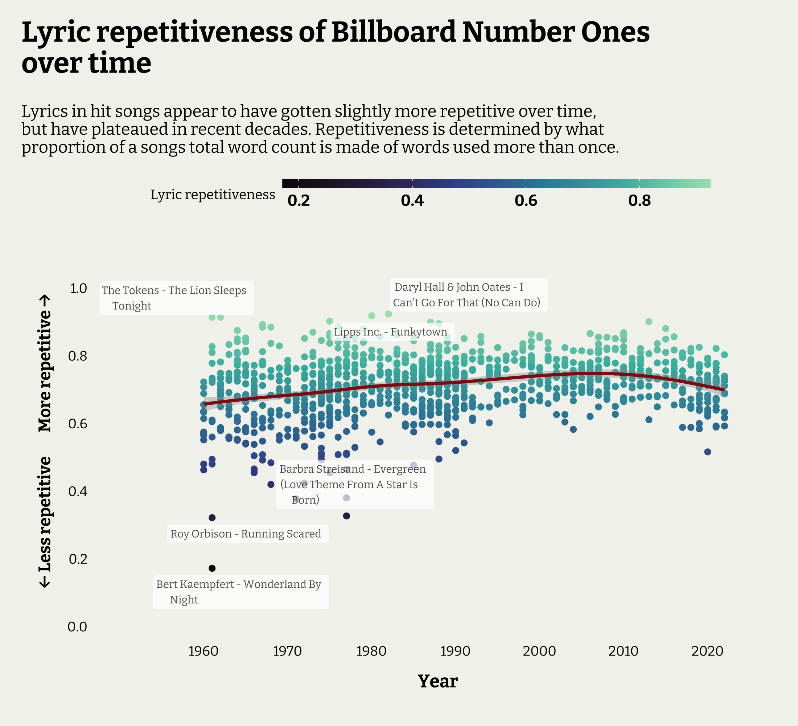

## Introduction

In this quick post I want to quickly explore the song lyrics from Billboard number 1 hits that I scraped together using Wikipedia and the Genius API. I won't get into the web scraping process, but was able to assemble data on the songs and their lyrics for most of the number one hits from 1960 to the end of 2022. The R code will be in my Github folder for this post. 

There's a million things we could do with text data like this, but let's narrow it down to a couple of key questions:

* **Have song lyrics gotten more repetitive over time?**
* **Is this still true when you account for the song's genre?**

## Quick summary and conclusion

The plot below shows the shows repetitiveness scores over time. The smoothed average shows a slight increase in repetition over the years, flattening out in the 2000s. However, variation in song repetition is larger in the earlier years, with a few clear outliers in the 60s that have very little lyric repetition.



A linear regression model did find that as Year increased, lyric repetition did, on average, increase slightly, after accounting for the changes in Genre popularity over time. A second model that included the word counts of the song lyrics confirmed that the song length was a much better explanation for changes in repetition.

## Method

First let's read in the data. I had the information stored on 3 files, so we'll need to join the together and keep the variables we want. The data has each song's name, the artist, the year and decade it was number one, song ID and genre tags from Genius, the number of word's in its lyrics, and the lyrics themselves. We can say that lyrics did get slightly more repetitive over time, which was due to hit songs becoming longer and wordier. As average song lengths move over time, we can expect lyric repetition to move with them.


```r
DATA <- left_join(
  select(BBOARD, Year:Artist_s), SONGS, by = 
) %>%
  left_join(., LYRICS, by = "song_id") %>%
  select(Year, Decade, Song, Artist, song_id, song_genre, lyric_count, song_lyrics )

head(DATA)
```

```
##   Year Decade                      Song              Artist song_id
## 1 1960  1960s                   El Paso       Marty Robbins  230015
## 2 1960  1960s              Running Bear      Johnny Preston 1513892
## 3 1960  1960s                Teen Angel        Mark Dinning  133982
## 4 1960  1960s Theme From A Summer Place         Percy Faith 1176835
## 5 1960  1960s              Stuck On You       Elvis Presley  197256
## 6 1960  1960s             Cathy's Clown The Everly Brothers      NA
##                                                  song_genre lyric_count
## 1             country_singer-songwriter_retro_murder-ballad         508
## 2                                                      rock         231
## 3 rock_pop_ballad_easy-listening_pop-rock_singer-songwriter         168
## 4                                          non-music_screen         108
## 5                                              rock_sixties         277
## 6                                                      <NA>          NA
##                                                                                                                                                                                                                                                                                                                                                                                                                                                                                                                                                                                                                                                                                                                                                                                                                                                                                                                                                                                                                                                                                                                                                                                                                                                                                                                                                                                                                                                                                                                                                                                                                                                                                                                                                                                                                                                                                                                                                                                                                                                                                                                                                                                                                                                                                                                                                                                                                                                                                              song_lyrics
## 1 [Verse 1] Out in the West Texas town of El Paso I fell in love with a Mexican girl Nighttime would find me in Rosa's Cantina Music would play and Feleena would whirl [Verse 2] Blacker than night were the eyes of Feleena Wicked and evil while casting her spell My love was deep for this Mexican maiden I was in love but in vain I could tell [Chorus 1] One night a wild young cowboy came in Wild as the West Texas wind Dashing and daring a drink he was sharing With wicked Feleena the girl that I love [Verse 3] So in anger I challenged his right for the love of this maiden Down went his hand for the gun that he wore My challenge was answered in less than a heartbeat The handsome young stranger lay dead on the floor [Full-Length Version - Verse 4] Just for a moment I stood there in silence Shocked by the foul evil deed I had done Many thoughts raced through my mind as I stood there I had but one chance and that was to run [Chorus 2] Out through the back door of Rosa's I ran Out where the horses were tied I caught a good one it looked like it could run Up on its back and away I did ride [Post-Chorus] Just as fast as I could From the West Texas town of El Paso Out to the badlands of New Mexico [Verse 5] Back in El Paso my life would be worthless Everything's gone in life nothing is left It's been so long since I've seen the young maiden My love is stronger than my fear of death [Chorus 3] I saddled up and away I did go Riding alone in the dark Maybe tomorrow a bullet may find me Tonight nothing's worse than this pain in my heart [Verse 6] And at last here I am on the hill overlooking El Paso I can see Rosa's Cantina below My love is strong and it pushes me onward Down off the hill to Feleena I go [Verse 7] Off to my right I see five mounted cowboys Off to my left ride a dozen or more Shouting and shooting I can't let them catch me I have to make it to Rosa's back door [Chorus 4] Something is dreadfully wrong for I feel A deep burning pain in my side Though I am trying to stay in the saddle I'm getting weary unable to ride [Verse 8] But my love for Feleena is strong and I rise where I've fallen Though I am weary I can't stop to rest I see the white puff of smoke from the rifle I feel the bullet go deep in my chest From out of nowhere Feleena has found me Kissing my cheek as she kneels by my side Cradled by two loving arms that I'll die for One little kiss and Feleena goodbye
## 2                                                                                                                                                                                                                                                                                                                                                                                                                                                                                                                                                                                                                                                                                                                                                                                                                                                                                                                                                                                                                                                                                                                                                                                                                                                          [Verse 1] On the bank of the river Stood Running Bear young Indian brave On the other side of the river Stood his lovely Indian maid Little White Dove was her name Such a lovely sight to see But their tribes fought with each other So their love could never be Running Bear loved Little White Dove With a love big as the sky Running Bear loved Little White Dove With a love that couldn't die [Verse 2] He couldn't swim the raging river 'Cause the river was too wide He couldn't reach Little White Dove Waiting on the other side In the moonlight he could see her Throwing kisses 'cross the waves Her little heart was beating faster Waiting there for her brave Running Bear loved Little White Dove With a love big as the sky Running Bear loved Little White Dove With a love that couldn't die [Verse 3] Running Bear dove in the water Little White Dove did the same And they swam out to each other Through the swirling stream they came As their hands touched and their lips met The raging river pulled them down Now they'll always be together In that happy huntin' ground Running Bear loved Little White Dove With a love big as the sky Running Bear loved Little White Dove With a love that couldn't die
## 3                                                                                                                                                                                                                                                                                                                                                                                                                                                                                                                                                                                                                                                                                                                                                                                                                                                                                                                                                                                                                                                                                                                                                                                                                                                                                                                                                                                                                                                                                                                                                                                                                                         Teen Angel Teen Angel Teen Angel [Verse 1] That fateful night The car was stalled Upon the railroad track I pulled you out and we were safe But you went running back Teen Angel Can you hear me?Teen Angel Can you see me?Are you somewhere up above?And am I still your own true love? [Verse 2] What was it you Were looking for? That took your life that night They said they found my high school ring Clutched in your fingers tight Teen Angel Can you hear me? Teen Angel Can you see me? Are you somewhere up above? And am I still your own true love? [Verse 3] Just sweet sixteen And now you're gone They've taken you away I'll never kiss your lips again They buried you today Teen Angel Can you hear me? Teen Angel Can you see me? Are you somewhere up above? And am I still your own true love? Teen Angel Teen Angel Answer me? Please!
## 4                                                                                                                                                                                                                                                                                                                                                                                                                                                                                                                                                                                                                                                                                                                                                                                                                                                                                                                                                                                                                                                                                                                                                                                                                                                                                                                                                                                                                                                                                                                                                                                                                                                                                                                                                                                                                                                                                                                                                           There's a summer place Where it may rain or storm Yet I'm safe and warm For within that summer place Your arms reach out to me And my heart is free from all care For it knows There are no gloomy skies When seen through the eyes Of those who are blessed with love And the sweet secret of A summer place Is that it's anywhere When two people share All their hopes All their dreams All their love And the sweet secret of a summer place Is that it's anywhere When two people share All their hopes All their dreams all their love
## 5                                                                                                                                                                                                                                                                                                                                                                                                                                                                                                                                                                                                                                                                                                                                                                                                                                                                                                                                                                                                                                                                                                                                                                                                                                                             [Verse 1] You can shake an apple off an apple tree Shake-a shake-a sugar but you'll never shake me Uh-uh-uh No-sir-ee uh uh I'm going to stick like glue Stick because I'm Stuck on you [Verse 2] I'm going to run my fingers thru your long black hair Squeeze you tighter than a grizzly bear Uh-uh-uh Yes-sir-ee uh uh I'm going to stick like glue Stick because I'm Stuck on you [Verse 3] Hide in the kitchen hide in the hall Ain't gonna do you no good at all 'Cause once I catch you and the kissing starts A team of wild horses couldn't tear us apart [Verse 4] Try to take a tiger from his daddy's side That's how love is going to keep us tied Uh-uh-uh Oh yeah uh uh I'm gonna stick like glue Stick because I'm Stuck on you [Verse 3] Hide in the kitchen hide in the hall Ain't gonna do you no good at all 'Cause once I catch you and the kissing starts A team of wild horses couldn't tear us apart [Verse 4] Try to take a tiger from his daddy's side That's how love is going to keep us tied Uh-uh-uh Yes-sir-ee uh uh I'm gonna stick like glue yeah yeah Because I'm stuck on you I'm gonna stick like glue yeah yeah Because I'm stuck on you I'm gonna stick like glue yeah yeah Because I'm stuck on you
## 6                                                                                                                                                                                                                                                                                                                                                                                                                                                                                                                                                                                                                                                                                                                                                                                                                                                                                                                                                                                                                                                                                                                                                                                                                                                                                                                                                                                                                                                                                                                                                                                                                                                                                                                                                                                                                                                                                                                                                                                                                                                                                                                                                                                                                                                                                                                                                                                                                                                                                                   <NA>
```

We are more likely to be missing lyrics for song from the 60s, and much less likely to be missing data from more recent songs. This is not ideal --  we'd prefer this missing data to be evenly spread -- but we still have at least 100 songs from each decade (except the 2020s), and we can assume that not being able to find the lyrics to a song is independent to the content of the lyrics itself which is what we are interested in.


```r
left_join(
  DATA %>%
  group_by(Decade) %>%
  summarise(n_hits = n_distinct(Song)),
  
  DATA %>%
  filter(is.na(song_id)) %>%
  group_by(Decade) %>%
  summarise(n_missing = n()),
  by = "Decade"
  ) %>%
  mutate(Prop_missing = n_missing/n_hits)
```

```
## # A tibble: 7 × 4
##   Decade n_hits n_missing Prop_missing
##   <chr>   <int>     <int>        <dbl>
## 1 1960s     203        56       0.276 
## 2 1970s     252        57       0.226 
## 3 1980s     233        47       0.202 
## 4 1990s     144        35       0.243 
## 5 2000s     130        23       0.177 
## 6 2010s     116        10       0.0862
## 7 2020s      51         6       0.118
```

We have song genre tags from Genius too, which we can use as an additional grouping variable. Let's extract those out and see how many categories there are. The first tag is always from one of the major Genius genre categories, with additional sub-genre tags after this. We only want the major category for our analysis.


```r
## Remove songs without lyrics or tags or words
HITS <- DATA %>%
  filter(!is.na(song_id) & !is.na(song_lyrics) & lyric_count > 0) %>%
  mutate(Genre = word(song_genre, 1, 1, sep = stringr::fixed("_")) %>% str_to_title())

HITS %>%
  group_by(Genre) %>%
  summarise(n = n())
```

```
## # A tibble: 6 × 2
##   Genre         n
##   <chr>     <int>
## 1 Country      23
## 2 Non-Music     1
## 3 Pop         497
## 4 R-B         237
## 5 Rap          70
## 6 Rock        220
```

Looks like there are only 6 major genres, with Country and Non-Music being small. Non-music is the song 'Theme from a Summer Place', a film soundtrack that became popular in 1960. Let's lump them into "Other" for when we exploring results by genre.


```r
HITS <- HITS %>%
  mutate(Genre = fct_lump_n(Genre, n = 4, other_level = "Other"))
```

We need to unnest the lyrics into tokens so we can calculate how repetitive a song is (what proportion of its words are used multiple times). First, the lyrics include some meta-information in square and curly brackets -- e.g. "[Verse 1]" -- that need to be removed.

Then we'll unnest the song lyrics so we have a large data frame with each word from each song on a row.


```r
HITS <- HITS %>%
  mutate(song_lyrics = str_remove_all(song_lyrics, "\\[[^\\]]*\\]|\\{[^\\]]*\\}") %>% str_squish())

library(tidytext)
TOKENS <- HITS %>%
  unnest_tokens(output = "token", input = "song_lyrics")

head(TOKENS)
```

```
##   Year Decade    Song        Artist song_id
## 1 1960  1960s El Paso Marty Robbins  230015
## 2 1960  1960s El Paso Marty Robbins  230015
## 3 1960  1960s El Paso Marty Robbins  230015
## 4 1960  1960s El Paso Marty Robbins  230015
## 5 1960  1960s El Paso Marty Robbins  230015
## 6 1960  1960s El Paso Marty Robbins  230015
##                                      song_genre lyric_count Genre token
## 1 country_singer-songwriter_retro_murder-ballad         508 Other   out
## 2 country_singer-songwriter_retro_murder-ballad         508 Other    in
## 3 country_singer-songwriter_retro_murder-ballad         508 Other   the
## 4 country_singer-songwriter_retro_murder-ballad         508 Other  west
## 5 country_singer-songwriter_retro_murder-ballad         508 Other texas
## 6 country_singer-songwriter_retro_murder-ballad         508 Other  town
```

Perfect! Let's look at a couple of interesting things before moving on to repetitiveness.

Have word choices changed over time? What are the most used words (words that appear in the most songs) for each decade. We'll use a stop list of uninteresting words to filter these out.

The results are plotted below. We clearly enjoy love songs, although use of the word 'love' itself has dropped in recent decades. Songs about our babies continue to be popular, and you can't go round with a few 'yeahs' in your song.


```r
STOP <- stop_words %>% filter(lexicon == "SMART")

TOKENS %>%
  filter(!token %in% STOP$word) %>%
  group_by(Decade, token) %>%
  summarise(N_songs = n_distinct(song_id), .groups = "drop_last") %>%
  slice_max(order_by = N_songs, n = 5) %>%
  left_join(., 
            HITS %>%
              group_by(Decade) %>%
              summarise(N_decade = n_distinct(song_id)), by = "Decade") %>%
  mutate(Pct = paste0(round(100*(N_songs/N_decade), 1), "%"),
         token2 = reorder_within(token, N_songs, Decade)) %>%
  ggplot(aes(y = token2)) +
  geom_col(aes(x = N_decade), fill = "grey80") +
  geom_col(aes(x = N_songs, fill = token)) +
  geom_text(aes(x = N_songs, colour = token, label = Pct), hjust = -0.15, size = 3, family = "bitter") +
  scale_y_reordered() +
  scale_fill_viridis_d(option = "mako", end = 0.6, begin = 0.1) +
  scale_colour_viridis_d(option = "mako", end = 0.6, begin = 0.1) +
  labs(title = "Most used words in Number 1 hits by decade",
       x = "Number of songs used in",
       y = "Word") +
  facet_wrap(Decade~., ncol = 4, scales = "free_y") +
  theme(legend.position = "none")
```

}}index_files/figure-html/unnamed-chunk-7-1.png" width="1400" />


What about by genre? Not much difference, though we have our 'oohs' in R&B songs, and no love in Rap songs (but a lot of babies).


```r
TOKENS %>%
  filter(!token %in% STOP$word) %>%
  group_by(Genre, token) %>%
  summarise(N_songs = n_distinct(song_id), .groups = "drop_last") %>%
  slice_max(order_by = N_songs, n = 5) %>%
  left_join(., 
            HITS %>%
              group_by(Genre) %>%
              summarise(N_genre = n_distinct(song_id)), by = "Genre") %>%
  mutate(Pct = paste0(round(100*(N_songs/N_genre), 1), "%"),
         token2 = reorder_within(token, N_songs, Genre)) %>%
  ggplot(aes(y = token2)) +
  geom_col(aes(x = N_genre), fill = "grey80") +
  geom_col(aes(x = N_songs, fill = token)) +
  geom_text(aes(x = N_songs, colour = token, label = Pct), hjust = -0.15, size = 3, family = "bitter") +
  scale_y_reordered() +
  scale_fill_viridis_d(option = "mako", end = 0.6, begin = 0.1) +
  scale_colour_viridis_d(option = "mako", end = 0.6, begin = 0.1) +
  labs(title = "Most used words in Number 1 hits by genre",
       x = "Number of songs used in",
       y = "Word") +
  facet_wrap(Genre~., ncol = 3, scales = "free_y") +
  theme(legend.position = "none")
```

}}index_files/figure-html/unnamed-chunk-8-1.png" width="1400" />

### Repetitiveness

Let's get back on track. We'll judge a track repetitiveness by what proportion of it's total word count is words used more than once. In a song where every word is repeated, this would be 1. In a song where every word sang is completely unique, this would be 0.

The plot below shows the shows repetitiveness scores over time. The smoothed average shows a slight increase in repetition over the years, flattening out in the 2000s. However, variation in song repetition is larger in the earlier years, with a few clear outliers in the 60s that have very little lyric repetition.


```r
library(ggrepel)

REP <- TOKENS %>%
  group_by(song_id, lyric_count) %>%
  summarise(n_unique = n_distinct(token), .groups = "drop") %>%
  mutate(repetitiveness = 1 - (n_unique/lyric_count)) %>%
  select(song_id, repetitiveness)

REP <- HITS %>%
  left_join(., REP, by = "song_id")

LABELS <- bind_rows(
  
  REP %>%
    distinct(Song, Artist, repetitiveness, .keep_all = TRUE) %>%
    slice_max(order_by = repetitiveness, n = 3),
  REP %>%
    distinct(Song, Artist, repetitiveness, .keep_all = TRUE) %>%
    slice_min(order_by = repetitiveness, n = 3)
)

REP %>%
  ggplot(aes(x = Year, y = repetitiveness)) +
  geom_point(aes(colour = repetitiveness)) +
  geom_smooth(colour = "firebrick4") +
  geom_label_repel(data = LABELS, aes(label = str_wrap(paste0(Artist, " - ", Song), 30)), size = 2.5, hjust = 0.1, family = "bitter", colour = "black", label.size = NA, alpha = 0.7) +
  scale_y_continuous(expand = expansion(mult = 0.3), breaks = c(0, 0.2, 0.4, 0.6, 0.8, 1)) +
  scale_x_continuous(expand = expansion(mult = c(0.2, 0.1)), breaks = c(1960, 1970, 1980, 1990, 2000, 2010, 2020)) +
  scale_colour_viridis_c(option = "mako", end = 0.9) +
  labs(title = "Lyric repetitiveness of Billboard Number Ones\nover time",
       subtitle = str_wrap("Lyrics in hit songs appear to have gotten slightly more repetitive over time, but have plateaued in recent decades. Repetitiveness is determined by what proportion of a songs total word count is made of words used more than once."),
       colour = "Lyric repetitiveness",
       y = "\u2190 Less repetitive        More repetitive \u2192") +
  theme(axis.title.y = element_text(size = 11),
        axis.text.y = element_text(size = 9, margin = margin(r= 8)),
        plot.subtitle = element_text(face = "plain", size = 11, margin = margin(b= 15, t = 5)),
        legend.title = element_text(size = 9),
        legend.margin = margin(b = 3),
        legend.key.height = unit(0.2, "cm"))
```

}}index_files/figure-html/unnamed-chunk-9-1.png" width="1400" />

### Analysing results with a linear model

We looked at the plot as said it appeared that repetitiveness is increasing over time. Let's use a linear regression model to see year is a significant predictor for repetitiveness. We might also be able to account for why this is.

The results from a model to predict repetitiveness by Genre and Year is shown below. It shows that Year is a significant predictor after accounting for Genre. Every year you can expect a very small (0.001) increase in the average lyric repetitiveness. However, with an adjusted R^2^ of 0.075, this model isn't explaining a lot of the variation in repetitiveness.


```r
library(tidymodels)

model1 <- lm(repetitiveness ~ Genre + Year, data = REP)
summary(model1)
```

```
## 
## Call:
## lm(formula = repetitiveness ~ Genre + Year, data = REP)
## 
## Residuals:
##      Min       1Q   Median       3Q      Max 
## -0.50817 -0.05337  0.00575  0.05528  0.22382 
## 
## Coefficients:
##               Estimate Std. Error t value Pr(>|t|)    
## (Intercept) -1.3884403  0.3116874  -4.455 9.31e-06 ***
## GenreR-B     0.0227604  0.0066742   3.410 0.000674 ***
## GenreRap    -0.0224971  0.0112512  -2.000 0.045809 *  
## GenreRock   -0.0062019  0.0069231  -0.896 0.370548    
## GenreOther  -0.0547864  0.0177896  -3.080 0.002126 ** 
## Year         0.0010551  0.0001567   6.733 2.75e-11 ***
## ---
## Signif. codes:  0 '***' 0.001 '**' 0.01 '*' 0.05 '.' 0.1 ' ' 1
## 
## Residual standard error: 0.08445 on 1042 degrees of freedom
## Multiple R-squared:  0.07776,	Adjusted R-squared:  0.07334 
## F-statistic: 17.57 on 5 and 1042 DF,  p-value: < 2.2e-16
```

I want to highlight two relationships. First, that a song's repetitiveness tends to increase as its total word count goes up, to a certain point. Second, that songs total word counts have been increasing over time, plateauing in the 2000s and coming down a little recently. This is the exact same pattern seen in overall repetitiveness, which may be explained best the changes in song lengths over time.


```r
ggplot(data = REP, aes(x = lyric_count, y = repetitiveness)) +
  geom_point() +
  geom_smooth(method = "loess", colour = "firebrick4")
```

}}index_files/figure-html/unnamed-chunk-11-1.png" width="1400" />

```r
ggplot(data = REP, aes(x = Year, y = lyric_count)) +
  geom_point() +
  geom_smooth(method = "loess", colour = "firebrick4")
```

}}index_files/figure-html/unnamed-chunk-11-2.png" width="1400" />

We'll fit a second model that includes a song's lyric count and view the results below. We can see that after adding in the lyric count, year is no longer a significant predictor.


```r
model2 <- lm(repetitiveness ~ Genre + lyric_count + Year, data = REP)
summary(model2)
```

```
## 
## Call:
## lm(formula = repetitiveness ~ Genre + lyric_count + Year, data = REP)
## 
## Residuals:
##      Min       1Q   Median       3Q      Max 
## -0.46568 -0.04880  0.00464  0.05044  0.25476 
## 
## Coefficients:
##               Estimate Std. Error t value Pr(>|t|)    
## (Intercept)  6.497e-01  3.220e-01   2.017 0.043901 *  
## GenreR-B     1.350e-02  6.171e-03   2.188 0.028895 *  
## GenreRap    -7.830e-02  1.110e-02  -7.055 3.14e-12 ***
## GenreRock   -9.035e-04  6.375e-03  -0.142 0.887334    
## GenreOther  -5.435e-02  1.635e-02  -3.324 0.000919 ***
## lyric_count  2.200e-04  1.587e-05  13.864  < 2e-16 ***
## Year        -1.241e-05  1.633e-04  -0.076 0.939429    
## ---
## Signif. codes:  0 '***' 0.001 '**' 0.01 '*' 0.05 '.' 0.1 ' ' 1
## 
## Residual standard error: 0.07762 on 1041 degrees of freedom
## Multiple R-squared:  0.2215,	Adjusted R-squared:  0.217 
## F-statistic: 49.37 on 6 and 1041 DF,  p-value: < 2.2e-16
```

We can compare the models too. The second model, with lyric word count, has a lower AIC, less deviance, and account for much more variation in repetitiveness (`adj.r.squared`) than the first model. It's simply explaining the variation much better than Year did. So we can say that lyrics did get slightly more repetitive over time, which was due to hit songs becoming longer and wordier. As average song lengths move over time, we can expect lyric repetition to move with them.


```r
bind_rows(glance(model1), glance(model2))
```

```
## # A tibble: 2 × 12
##   r.squared adj.r.squared  sigma statistic  p.value    df logLik    AIC    BIC
##       <dbl>         <dbl>  <dbl>     <dbl>    <dbl> <dbl>  <dbl>  <dbl>  <dbl>
## 1    0.0778        0.0733 0.0844      17.6 9.71e-17     5  1106. -2198. -2164.
## 2    0.222         0.217  0.0776      49.4 1.70e-53     6  1195. -2374. -2334.
## # ℹ 3 more variables: deviance <dbl>, df.residual <int>, nobs <int>
```


