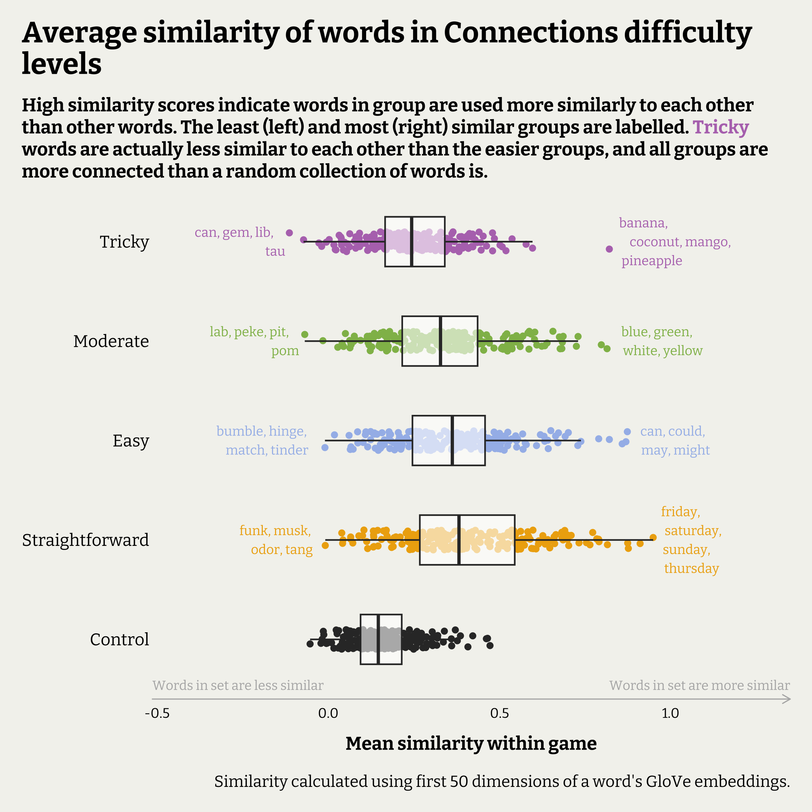
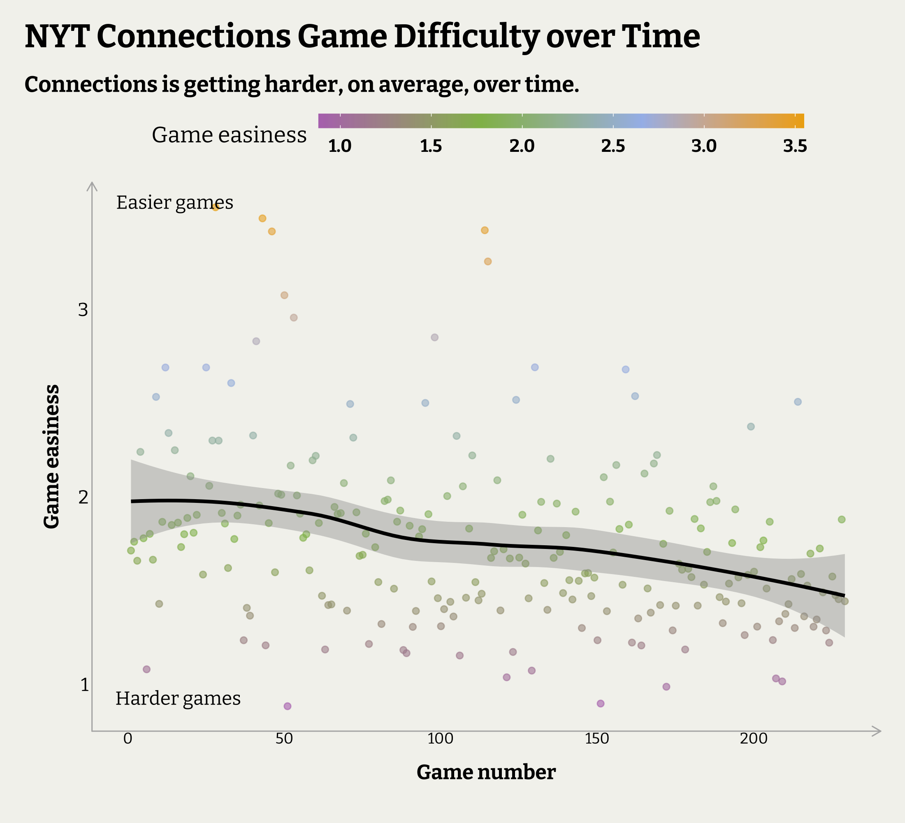

```{r, include=FALSE}
knitr::opts_chunk$set(echo = TRUE, warning = FALSE, message = FALSE, fig.asp = 0.7, dpi = 200, fig.retina = 2, fig.showtext = TRUE)

library(tidyverse)
library(reactable)
library(showtext)

font_add_google("Bitter", "bitter", regular.wt = 400, bold.wt = 700)
showtext_auto()
showtext_opts(dpi = 250)

cYellow <- "darkgoldenrod2"
cBlue <- "#a4bcea"
cGreen <- "#90bb58"
cPurple <- "#B576BB"

cPalette <- c(cYellow, cBlue, cGreen, cPurple)

# graph theme set ####
theme_set(theme_void() +
            theme(plot.background = element_rect(fill = "#F3F3EE", colour = "#F3F3EE"),
                  plot.margin = unit(c(0.5, 0.5, 0.5, 0.5), "cm"),
                  text = element_text(size = 13, family = "bitter"),
                  plot.title = element_text(family = "bitter", face = "bold", size = 19, margin = margin(b = 12)),
                  plot.title.position = "plot",
                  plot.subtitle = element_text(face = "bold", margin = margin(1,1,10,1)),
                  legend.position = "top",
                  legend.title = element_text(),
                  legend.box.margin = margin(b = 10, r = 10),
                  legend.text = element_text(face = "bold", margin = margin(l = -0.8, r = 0.5, unit = "cm")),
                  legend.key.width = unit(2, "cm"),
                  legend.key.height = unit(0.9, "cm"),
                  axis.title = element_text(size = 12, face = "bold", margin = margin(10,10,10,10)),
                  axis.title.y = element_text(angle = 90),
                  axis.text.y.right = element_text(size = 0),
                  axis.text.y = element_text(size = 11, hjust = 1, margin = margin(r = 2)),
                  axis.text.x = element_text(size = 9, hjust = 0.5),
                  panel.spacing.y = unit(0.5, "cm"),
                  strip.text = element_text(size = 14, colour = "grey30", family = "bitter", face = "bold", margin = margin(b=3)),
                  strip.background = element_blank()))


```

## Introduction

Let's look at another popular NY Times game, this time the [Connections game](https://www.nytimes.com/games/connections). If you're not familiar with this game, the concept is straightforward. You are presented with 16 words and you need to group them into 4 groups of 4 words by identifying the hidden connection between the words in a group. In each game, there are 4 different difficulty groups, from Straightforward to Tricky, based on how simple or abstract the 'connection' between the 4 words is.

For example, the solution to the most recent puzzle is:

* [Straightforward] Highest Point: *Crest, Peak, Summit, Vertex*
* [Easy] “Can I Get Your ___?” (Phone Info Request): *Cell, Contact, Digits, Number*
* [Moderate] Modifiers Meaning “Small”: *Baby, Mini, Pocket, Toy*
* [Tricky] Inside A Scrabble Box: *Bag, Board, Racks, Tiles*

As a regular player of Connections, there were a couple of questions that interested me and thought it was a good opportunity to use some statistics to explore the answers to these. It is a perfect word game for illustrating the concept of 'word embeddings', which a widely used in machine-learning and AI models and a critical to being able to build the advanced large language models (LLMs) we see today. We'll use them in a much simpler way today though!

At their simplest, word embeddings are a way to represent a word as a series (or vector) of numbers based on samples of where and how the word is used. Words that are used in similar ways or contexts should have more similar word embedding vectors than those that don't. This is usually measured with cosine similarity, which produces a similarity score by measuring the distance between vectors. Put simply, it allows us to compare things across multiple measurements at once (e.g. how similar you are to another person across multiple factors -- height, weight, age, number of siblings, income, etc. -- rather than just one). Cosine similarity is ubiquitous in modern software and an important part of how today's apps and websites recommend you other products or different movies based on how similar your tastes are to other people like you. 

Let's use these concepts to answer 3 questions:

* **Are the words in Connections group actually more similar to each other than a random selection of four words?**
* **Are the difficulty ratings from a game accurate? Are the 'Tricky' groups actually less similar to each other than the 'Straightforward' ones?**
* **Are Connections games getting harder over time?**

## Quick summary and conclusions

The plot below visualises the answers to the first two questions. Each dot represents a group of 4 words, and its position on the x-axis (horizontal) is how similar to each other the words are. Higher values equate to higher similarity (stronger connection) within the group, so the closer to one a groups' similarity score is, the more alike the words are. The most similar sets of words from each difficulty level are on the right of the graph, while the least similar are to the left.

In black is the Control group. For each game we had data from, we created a random group of 4 words with no pre-determined connection by selecting 4 random words from the full set of all words that had been used before. By selecting random groups, we've 'broken' the connections between the words which gives us a reference for what levels of similarity we would expect between four words not grouped together.

Immediately we can confirm two thing visually. First, the Control group has lower similarity scores than the actual groups of words from the games, so we can say it looks like the groups in the game are meaningfully connected. Secondly, it does appear that as the difficulty increases, the less similar the word sets become, indicating that the difficulty labels are accurate (i.e the Tricky sets are less similar to each other than the Straightforward sets). There is quite a lot of spread from game to game here, and the Easy and Straightforward difficulty levels don't appear that meaningfully different in terms of similarity scores.



Let's confirm our interpretations of the plot with a T-test. The results for this are below, and are used to answer the question, do the different groups *actually* have different averages after accounting for sample size and variance. We're looking for p-values of less that 0.05, and preferably less that 0.01.

The results below show:

* There is very strong evidence that all 4 difficulty levels are different (less similar to each other) to the control groups.
* There is very strong evidence that the highest difficulty level is different (less similar to each other) to all the other difficulty levels, i.e. Tricky does mean *tricky*.
* There is no evidence the middle 2 difficulty levels are that different.
* There is only a little evidence that the second difficulty level (Easy) is different to the easiest difficulty level (Straightforward).

```{r, echo = FALSE}
read.csv("t_test_results.csv") %>%
  select(- .y., -p, -p.adj, -method) %>%
  mutate(
    group1 = factor(group1, levels = c(0:4), labels = c("Control", "Straightforward", "Easy", "Moderate", "Tricky")),
    group2 = factor(group2, levels = c(0:4), labels = c("Control", "Straightforward", "Easy", "Moderate", "Tricky"))
  ) %>%
  setNames(nm = c("Difficulty 1", "Difficulty 2", "p-value", "Significance")) %>%
  reactable(striped = TRUE, highlight = TRUE,
            style = list(fontFamily = c("bitter", "Arial")))
```

The plot below shows that the game difficulty is increasing, on average, over time. For each game, this is based on how much more similar the words in each difficulty group are to each other than all the words in the game are to each other. The higher the score, the more differentiated the words in the groups are from the whole game, which makes for an easier game.



## Method

I won't get into details on how the data set was put together. The full code for scraping and assembling the answers and attaching their word embeddings is in the Appendix. I will simply read in the pre-cleaned data below and show you what it looks like.

```{r}
CON_CLEAN <- read.csv("connections_answers.csv")
head(CON_CLEAN)
```

The game data itself is straightforward. For each game we have the words in it, and what group they were a part of. The other variables (starting with V) are our word embedding dimensions. I have used the [pre-trained GloVe embeddings from Stanford](https://nlp.stanford.edu/projects/glove/), specifically, the 50 dimension, '6b' embeddings - a set of words trained from 6 billion token examples. This is the smallest one but should be plenty informative for this purpose.

It's important to mention that since some Connections words are 2-word phrases, these couldn't be matched to a word embedding. Since these are necessary for the analysis, any set of words that included an answer with missing embedding data was removed. This means that some games don't have all 4 sets of words, but this is minimal and doesn't affect the similarity analysis  as this happens within sets.

First, let's quickly visualise our data. Let's take the four most recent games and plot the answers by the first 2 Principal Components of each word's word embeddings. This doesn't show all the information captured in the 50 word embedding dimensions, but is handy for quickly seeing how connected a whole 'game' appears in 2-dimensional space.

Below are the plots for this. Notice how the Trickiest sets (purple) of words tend to be spread across the entire space, tangled amongst the other words. We can also see a popular trick in the game, where 3 of the words in the easiest (yellow) set are close together and obvious, but one is less connected and sits among other words.

```{r, fig.asp= 1.4}
PCA <-prcomp(CON_CLEAN[, 6:55])

CON_CLEAN <- bind_cols(
  CON_CLEAN,
  as_tibble(PCA$x[,1:2]) %>% setNames(., c("PC1", "PC2"))
)


CON_CLEAN %>%
  mutate(Difficulty = factor(Difficulty, levels = c(1:4), labels = c("Straightforward", "Easy", "Moderate", "Tricky"))) %>%
  filter(Game_ID %in% unique(CON_CLEAN$Game_ID)[2:5]) %>%
  ggplot(aes(x = PC1, y = PC2, colour = Difficulty)) +
  geom_point(size = 2, alpha = 1) +
  geom_line(alpha = 0.3, show.legend = FALSE) +
  geom_text(aes(label = Word), size = 3, vjust = -1, family = "bitter", show.legend = FALSE) +
  scale_colour_manual(values = cPalette) +
  scale_x_continuous(expand = expansion(mult = 0.2)) +
  scale_y_continuous(expand = expansion(mult = 0.2)) +
  labs(title = "Spread of Connections words based on GloVe\nword embeddings") +
  facet_wrap(Game_ID~., ncol = 2) +
  guides(colour = guide_legend(override.aes = list(size = 6), nrow = 2, byrow = TRUE))
```

Now we need to get our similarity scores. The code below calculates these using the `cosine` function from the `lsa` package. I've created a custom function that is mapped to each games. For each game, it will return:

* The average similarity of the words within each difficulty group
* The average similarity of the words for that entire game not including the control (i.e. how similar are all 16 words to each other, on average)

The first is the main statistic we need. Once this information is calculated, we can find the average similarity of the word sets for each difficulty level and compare them to find out if they are different.

We also want a control. In the code below, random sets of 4 words are created, with a control set for each game. This is a set of 4 groups with (theoretically) no connection to each other. This will help us see if the Connections groups are genuinely more similar to each other than any random set of 4 words.


```{r}
library(lsa)

cosine_wrangler <- function(F1) {
  test <- F1 %>%
    select(starts_with("V")) %>%
    as.matrix() %>% t() %>%
    cosine()
  
  ## average similarity of all words in the game (excluding control)
  game <- test %>%
    as_tibble() %>%
    setNames(nm = make.unique(F1$Word)) %>%
    mutate(Word = F1$Word,
           Connect_ID = F1$Connect_ID) %>%
    pivot_longer(
      cols = -c(Word:Connect_ID),
      names_to = "Comp_Word",
      values_to = "Similarity"
    ) %>%
    filter(Word != Comp_Word & Similarity != 1) %>%
    filter(!str_detect(Connect_ID, "_0$")) %>%
    distinct(Similarity, .keep_all = TRUE) %>% 
    summarise(Game_ID = F1$Game_ID[1],
              Mean_G = mean(Similarity))
  
  ## average similarity of words within difficulty to each other within game
  test <- test %>%
    as_tibble() %>%
    setNames(nm = make.unique(F1$Word)) %>%
    mutate(Word = F1$Word,
           Connect_ID = F1$Connect_ID) %>%
    pivot_longer(
      cols = -c(Word:Connect_ID),
      names_to = "Comp_Word",
      values_to = "Similarity"
    ) %>%
    filter(Word != Comp_Word & Similarity != 1) %>%
    left_join(
      .,
      F1 %>%
        select(Word, Connect_ID) %>%
        distinct(Word, .keep_all = TRUE) %>%
        rename("Comp_Connect_ID" = "Connect_ID"),
      by = c("Comp_Word" = "Word")
    ) %>%
    filter(Connect_ID == Comp_Connect_ID) %>%
    group_by(Connect_ID) %>%
    distinct(Similarity, .keep_all = TRUE) %>%
    summarise(Mean_S = mean(Similarity)) %>%
    mutate(Mean_G = game$Mean_G) ## add overall game similarity
  
  return(test)
}

## for each game in sample, create a completely random selection of 4 words as control
set.seed(2023)
CON_SAMPLE <- slice_sample(CON_CLEAN, n = 4*n_distinct(CON_CLEAN$Game_ID), replace = TRUE) %>%
  mutate(Difficulty = 0,
         Game_ID = rep(unique(CON_CLEAN$Game_ID), each = 4),
         Connect_ID = paste0(Game_ID, "_", Difficulty))

# for each game get the overall game similarity, and within group similarity for each game
CON_SIMI <- CON_CLEAN %>%
  bind_rows(., CON_SAMPLE) %>% 
  group_by(Game_ID) %>%
  group_split() %>%
  map(., ~cosine_wrangler(.x)) %>%
  bind_rows() %>%
  mutate(Difficulty = stringr::word(Connect_ID, 2, sep = stringr::fixed("_")),
         Difficulty = as.factor(Difficulty))

pLABELS <- bind_rows(EASIEST <- CON_SIMI %>%
                       filter(Difficulty != 0) %>%
                       group_by(Difficulty) %>%
                       slice_max(n = 1, order_by = Mean_S) %>%
                       left_join(., select(CON_CLEAN, Connect_ID, Word), by = "Connect_ID") %>%
                       mutate(Words = str_c(Word, collapse = ", ")) %>%
                       distinct(Connect_ID, .keep_all = TRUE),
                     
                     HARDEST <- CON_SIMI %>%
                       filter(Difficulty != 0) %>%
                       group_by(Difficulty) %>%
                       slice_min(n = 1, order_by = Mean_S) %>%
                       left_join(., select(CON_CLEAN, Connect_ID, Word), by = "Connect_ID") %>%
                       mutate(Words = str_c(Word, collapse = ", ")) %>%
                       distinct(Connect_ID, .keep_all = TRUE)) %>%
  mutate(Difficulty = factor(Difficulty, levels = c(1:4), labels = c("Straightforward", "Easy", "Moderate", "Tricky")))
  
```


Using a T-test, we can determine if we have evidence that the higher difficulty groups are actually less similar to each other than the easier groups. We can also determine if the connected groups in the games are actually more 'connected' than a random selection of 4 words. Since there will be a T-test for each pair of difficulty level, we'll include a Bonferroni correction to account for the larger number of hypothesis tests being done. This is important to do when doing multiple hypothesis tests, as the more test you do, the higher the chances there are you will make a Type I error (false positive).

The results below show:

* There is very strong evidence that all 4 difficulty levels are different (less similar to each other) to the control groups.
* There is very strong evidence that the highest difficulty level is different (less similar to each other) to all the other difficulty levels, i.e. Tricky does mean *tricky*.
* There is no evidence the middle 2 difficulty levels are that different.
* There is only a little evidence that the second difficulty level is different to the easiest difficulty level.


```{r}
library(ggpubr)

compare_means(Mean_S ~ Difficulty, data = CON_SIMI, p.adjust.method = "bonferroni", method = "t.test") 
```


```{r, fig.asp = 1}
library(ggtext)

CON_SIMI %>%
  mutate(Difficulty = factor(Difficulty, levels = c(0:4), labels = c("Control", "Straightforward", "Easy", "Moderate", "Tricky"))) %>%
  ggplot(aes(y = Difficulty, x = Mean_S)) +
  geom_jitter(aes(colour = Difficulty), height = 0.1) +
  geom_boxplot(alpha = 0.6, outlier.alpha = 0, width = 0.5) +
  geom_text(data = pLABELS, aes(label = str_wrap(Words, 15), colour = Difficulty), vjust = 0.5, hjust = ifelse(pLABELS$Mean_S < 0.5, 1.2, -0.2), size = 3, family = "bitter") +
  annotate("text", y = -Inf, x = Inf, label = "Words in set are more similar", hjust = 1, vjust = -1, size = 3, family = "bitter", colour = "grey70") +
  annotate("text", y = -Inf, x = -Inf, label = "Words in set are less similar", hjust = 0, vjust = -1, size = 3, family = "bitter", colour = "grey70") +
  scale_x_continuous(expand = expansion(add = 0.4)) +
  scale_colour_manual(values = c("grey20", cPalette)) +
  labs(title = "Average similarity of words in Connections difficulty\nlevels",
       subtitle = str_wrap("High similarity scores indicate words in group are used more similarly to each other than other words. The least (left) and most (right) similar groups are labelled. <span style = 'color:#B576BB;'>Tricky</span> words are actually less similar to each other than the easier groups, and all groups are more connected than a random collection of words is."),
       y = NULL,
       x = "Mean similarity within game",
       caption = "Similarity calculated using first 50 dimensions of a word's GloVe embeddings.") +
  theme(legend.position = "none",
        plot.subtitle = element_textbox_simple(size = 12),
        axis.text.x = element_text(margin = margin(t= 5)),
        axis.line.x = element_line(arrow = arrow(length = unit(0.2, "cm")), colour = "grey70")
  )

```

### Visualising the hardest and easiest games

When calculating the similarity scores above, we also calculated the average similarity of the words for the whole game. We can use this information to create a score of how tricky a game is. Let's look at a game to explain.

```{r}
CON_SIMI %>% tail(4) %>%
  mutate(Ratio = Mean_S/Mean_G)
```


In theory, for each game we would expect the Similarity of a set (`Mean_S`) to set higher than the Similarity of a whole game (`Mean_G`). Above, in Game 99, the easiest level (1) are much more similar to each (0.51) than the overall similarity of the game words (0.23). As a ratio (`Ration`), we see this is 2.3 times more similar, which is what makes it an easy group. They are more obviously similar to each other than all the words are in total.

Again, look at the most difficult set. It's ratio is 0.54. This is a very tricky set since the 4 words are less similar to each other than the overall game similarity. It would be tricky to see their connection at first until you'd removed some of the other sets.

If we averaged the Ratio's for each game, we would expect easier games to have higher ratios (as each set is on average more similar to each other than the rest of the words in the game), and harder games to have lower ratios. This is done below, and then the results are displayed over time. It definitely looks like the games are getting trickier on average over time.

```{r, fig.asp=0.8}
GAMES <- CON_SIMI %>%
  filter(Difficulty != 0) %>%
  mutate(Game_ID = word(Connect_ID, 1, sep = stringr::fixed("_"))) %>%
  group_by(Game_ID) %>%
  mutate(Game_diff = Mean_S/Mean_G) %>%
  summarise(Mean_Game = mean(Game_diff)) %>%
  mutate(Game_no = str_extract(Game_ID, " \\d*$") %>% as.numeric())


GAMES %>%
  ggplot(aes(x = Game_no, y = Mean_Game)) +
  geom_point(aes(colour = Mean_Game), alpha = 0.6) +
  geom_smooth(method = "loess", formula = "y~x", colour = "black") +
  scale_colour_gradientn(colours = rev(cPalette)) +
  labs(title = "NYT Connections Game Difficulty over Time",
       subtitle = "Connections is getting harder, on average, over time.",
       y = "Game easiness",
       colour = "Game easiness",
       x = "Game number") +
  annotate("text", x = 0, y = Inf, label = "Easier games", hjust = 0.1, vjust = 2, family = "bitter") +
  annotate("text", x = 0, y = -Inf, label = "Harder games", hjust = 0.1, vjust = -2, family = "bitter") +
  theme(
    legend.key.height = unit(0.3, "cm"),
    axis.line = element_line(arrow = arrow(length = unit(0.2, "cm")), colour = "grey70")
  )

```

We can also pull out the easiest and hardest game ever, and visual them. Notice in the plots below that in the easiest game the words in each set sit closer together and there is less overlapping, compared to the most difficult game, where the sets all sit atop one another.

```{r}
easyHARD <- tibble(Game_ID = as_vector(c(GAMES[which.max(GAMES$Mean_Game), 1], GAMES[which.min(GAMES$Mean_Game), 1])),
                   Game_Rank = c("Easiest Game", "Hardest Game"))

CON_CLEAN  %>%
  mutate(Difficulty = factor(Difficulty, levels = c(1:4), labels = c("Straightforward", "Easy", "Moderate", "Tricky"))) %>%
  filter(Game_ID %in% easyHARD$Game_ID) %>%
  left_join(., easyHARD, by = "Game_ID") %>%
  mutate(Game_ID = paste0(Game_Rank, "\n", Game_ID)) %>%
  ggplot(aes(x = PC1, y = PC2, colour = Difficulty)) +
  geom_point(size = 2) +
  geom_line(alpha = 0.6, show.legend = FALSE) +
  geom_text(aes(label = Word), size = 3, vjust = -1, show.legend = FALSE) +
  scale_colour_manual(values = cPalette) +
  scale_x_continuous(expand = expansion(mult = 0.2)) +
  scale_y_continuous(expand = expansion(mult = 0.2)) +
  labs(title = "Spread of Connections words based on GloVe\nword embeddings") +
  facet_wrap(Game_ID~., ncol = 2) +
  guides(colour = guide_legend(override.aes = list(size = 6)))
```


### Appendix

#### How to scrape the Connections answers data set

```{r, eval = FALSE}

EMBED <- read.table("glove.6B.50d.txt", header = FALSE, quote = "") ### you'll need to download and save a copy of the GloVe word embeddings seperately.

URL_RAW <- read_html("https://tryhardguides.com/nyt-connections-answers/") %>%
  html_elements("#post-827131 > div.entry-content > ul") %>%
  html_elements("li") %>%
  html_text()

CONNECTIONS <- tibble(
  raw_txt = URL_RAW
) %>%
  mutate(Game_ID = str_extract(raw_txt, "^NYT Connections [[:digit:]]+")) %>%
  fill(Game_ID, .direction = "down")  %>%
  filter(!str_detect(raw_txt, "^NYT Connections")) %>%
  mutate(Difficulty = rep(1:4, length.out = nrow(.)),
         words_raw = str_extract(raw_txt, "(?<= - ).*"))

CONNECTIONS <- bind_cols(
  CONNECTIONS,
  str_split(CONNECTIONS$words_raw, pattern = ",", n = 4, simplify = TRUE) %>%
    as_tibble(.name_repair = make.names) %>%
    setNames(., nm = paste0("Word_", 1:4))
)

CONNECTIONS <- CONNECTIONS %>% 
  pivot_longer(starts_with("Word_"), names_to = "Word_number", values_to = "Word") %>%
  mutate(Word = str_squish(Word) %>% str_to_lower(),
         Connect_ID = paste(Game_ID, Difficulty, sep = "_")
         ) %>%
  select(Game_ID, Connect_ID, Word_number, Difficulty, Word) %>%
  left_join(., EMBED,
            by = c("Word" = "V1"))

MISSING_SETS <- CONNECTIONS %>% filter(is.na(V2)) %>%
  pull(Connect_ID) %>% unique()

CON_CLEAN <- CONNECTIONS %>%
  filter(!Connect_ID %in% MISSING_SETS)


write.csv(CON_CLEAN, "connections_answers.csv", row.names = FALSE)

```

