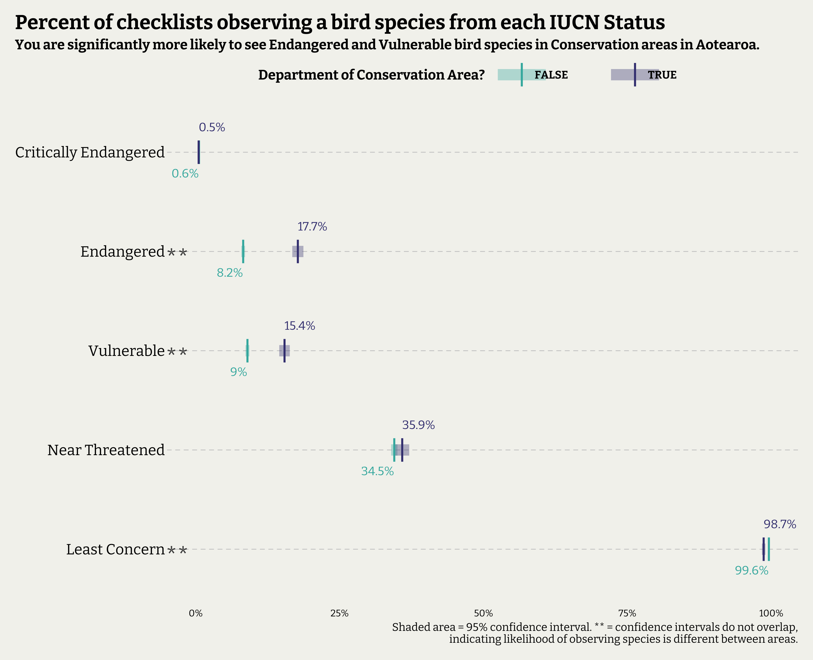
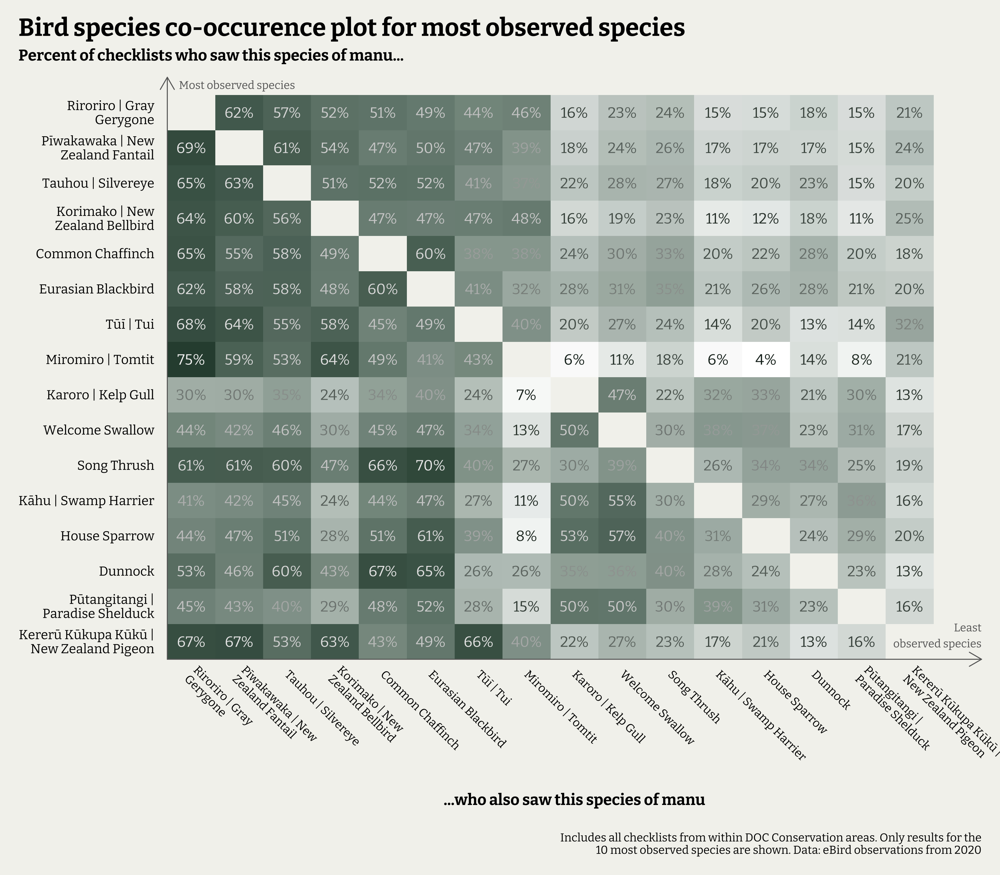

In this post I wanted to re-use a data set I had assembled as part of my larger Masters project. This data set includes bird observation data submitted to eBird from 2016-2020. Using the location data included I added additional information about whether the observation occurred in a Department of Conservation (DOC) area, as well as adding in the te reo Māori names for the bird species and their endangered status from the International Union for the Conservation of Nature (IUCN).

There were two key questions I wanted to answer:

-   Were you significantly more likely to observe more endangered species within conservation areas than outside them?
-   How often did different species co-occur within conservation areas? If you saw one species, how likely was it you also saw another in the same walk?

The eBird data was perfect for these questions, with a bit of tidying to produce a suitable sample. The plots showing the answers to each question are below. The full analysis details and code are after them in the Appendix.

Some key information to know is that eBird data is sorted by checklist. Each checklist indicates a single bird-watching "session", where all the species observed in a continuous period are recorded. eBird includes additional information about each checklist, so I could control for some possible causes of variation in observations, such as how long they recorded their observations for. I only kept checklists from 2020 that had been recorded over a period of 15 minutes to 2 hours.

There were large amounts of checklists, with 34,744 in total kept in the sample.

**Were you more likely to see endangered species in DOC conservation areas?**



The plot above shows the percentage of checklists that observed a species from each IUCN conservation category, split by whether the checklist was taken in a DOC conservation area or not. There are clear differences in the observation rate of Endangered and Vulnerable species, with more significantly more observations in DOC conservation areas. These results are statistically significant at the 95% confidence level.

If you spend up to 2 hours in a conservation area, you have a roughly 18% probability of seeing an endangered bird, compared to an 8% probability outside of one.

**Which commonly seen bird species in DOC areas were often seen together?**

The plot below summarises how often bird species were observed on the same checklist. To read it, select a manu | bird from the left (*y*) axis and follow across to a second species on the *x*-axis. The percentage is the proportion of checklists that saw the left species that also observed the second.

For example, 69% of the checklists that observed a pīwakawaka (the second most observed species in the DOC conservation areas) also observed a Riroriro (the most observed species in conservation areas).



## Appendix

### Code for plot 1


```r
## Filter down to appropriate sample
pDATA_1 <- DATA %>%
  filter(duration_minutes >= 15 & duration_minutes <= 120 & Status %in% c("Introduced", "Native/Endemic")) %>%
  select(checklist_id,common_name, reo_m, Status, IUCN_status, DOC_conservation_area) %>%
  mutate(DOC_conservation_area = !is.na(DOC_conservation_area))


## Create a reference of checklist IDs and their locations
CHECKLISTS <- pDATA_1 %>%
  group_by(checklist_id) %>%
  summarise(DOC_area = ifelse(sum(DOC_conservation_area) > 0, TRUE, FALSE), .groups = "drop") 

## Sample size from locations for calculation Std. Error
CHECKLISTS_n <- CHECKLISTS %>%
  group_by(DOC_area) %>%
  summarise(n_check = n())


pDATA_1 <- pDATA_1 %>%
  group_by(checklist_id, IUCN_status) %>%
  summarise(Observed = 1) %>%
  ungroup() %>%
  complete(checklist_id, IUCN_status, fill = list(Observed = 0)) %>% ## make non-observations explicit as 0
  left_join(., CHECKLISTS, by = "checklist_id") %>%
  group_by(DOC_area, IUCN_status) %>%
  summarise(Prop = mean(Observed), .groups = "drop") %>%
  left_join(., CHECKLISTS_n, by = "DOC_area") %>%
  mutate(SE = sqrt((Prop * (1-Prop))/n_check), ## standard error for a proportion
            CI_L = Prop - (1.96*SE), ## confidence limit lower
            CI_U = Prop + (1.96*SE)) %>% ## confidence limit upper
  filter(IUCN_status != "Unknown") %>%
  ungroup()

pDATA_1 <- left_join(
  pDATA_1 %>% filter(DOC_area == TRUE) %>% select(-DOC_area),
  pDATA_1 %>% filter(DOC_area != TRUE) %>% select(-DOC_area),
  by = "IUCN_status") %>%
  mutate(signif = case_when(
    CI_U.x < CI_L.y | CI_L.x > CI_U.y ~ "**", ## identify non-overlapping confidence intervals to determine significant differences
    TRUE ~ ""
  )) %>%
  select(IUCN_status, signif) %>%
  left_join(., pDATA_1, by = "IUCN_status")

## Plot data

pDATA_1 %>%
  mutate(IUCN_status = factor(IUCN_status, levels = c("Critically Endangered", "Endangered", "Vulnerable", "Near Threatened", "Least Concern"))) %>%
  ggplot(aes(y = IUCN_status, colour = DOC_area)) +
  geom_segment(aes(yend = IUCN_status, x = CI_L, xend = CI_U), alpha = 0.35, linewidth = 5) +
  geom_point(aes(x = Prop), size = 8, shape = "|") +
  geom_text(data = pDATA_1 %>% filter(DOC_area == TRUE),
            aes(x = Prop, label = paste0(round(100*Prop, 1), "%")), size = 4, vjust = -2.5, hjust = 0, family = "bitter", show.legend = FALSE) +
  geom_text(data = pDATA_1 %>% filter(DOC_area != TRUE),
            aes(x = Prop, label = paste0(round(100*Prop, 1), "%")), size = 4, vjust = 3, hjust = 1, family = "bitter", show.legend = FALSE) +
  geom_text(aes(label = signif, x = 0), size = 8, colour = "grey30", vjust = 0.9, hjust = 1.3, family = "bitter", show.legend = FALSE) +
  scale_x_continuous(labels = scales::percent) +
  scale_y_discrete(limits = rev) +
  scale_color_viridis_d(option = "mako", end = 0.7, begin = 0.3, direction = -1) +
  theme(panel.grid.major.y = element_line(colour = "grey80", linetype = "dashed"),
        axis.text.y = element_text(size = 14),
        legend.title = element_text(face = "bold")) +
  labs(title = "Percent of checklists observing a bird species from each IUCN Status",
       subtitle = "You are significantly more likely to see Endangered and Vulnerable bird species in Conservation areas in Aotearoa.",
       colour = "Department of Conservation Area?",
       x = "Percent of checklists",
       y = NULL,
       caption = str_wrap("Shaded area = 95% confidence interval. ** = confidence intervals do not overlap, indicating likelihood of observing species is different between areas."))
```

### Code for plot 2


```r
pDATA_2 <- DATA %>%
  filter(!is.na(DOC_conservation_area)) %>% ## only keep observations from DOC areas
  filter(duration_minutes >= 15 & duration_minutes <= 120 & Status %in% c("Introduced", "Native/Endemic")) %>%
  mutate(bird_name = case_when( ## join English names a te reo Māori names
    reo_m != common_name ~ paste0(reo_m, " | ", common_name),
    is.na(reo_m) ~ common_name,
    TRUE ~ reo_m
  ))

## Reference list of top 15 most observed species
SPECIES <- pDATA_2 %>%
  select(checklist_id, bird_name)%>%
  mutate(observed = TRUE) %>%
  distinct() %>%
  group_by(bird_name) %>%
  summarise(n = sum(observed)) %>%
  slice_max(n = 15, order_by = n, with_ties = TRUE) %>%
  mutate(bird_name = str_to_title(bird_name) %>% str_wrap(., 20),
         bird_name = fct_reorder(bird_name, n))


OBS <- pDATA_2 %>%
  mutate(bird_name = str_to_title(bird_name) %>% str_wrap(., 20)) %>%
  select(checklist_id, bird_name)%>%
  filter(bird_name %in% SPECIES$bird_name) %>%
  mutate(observed = TRUE) %>%
  distinct() %>%
  complete(checklist_id, bird_name, fill = list(observed = FALSE)) %>%
  pivot_wider(names_from = bird_name, values_from = observed)


pDATA_2 <- OBS %>%
  pivot_longer(cols =-checklist_id) %>%
  left_join(., OBS, by = "checklist_id") %>%
  filter(value == TRUE) %>%
  group_by(name) %>%
  summarise(across(where(is.logical),
                   ~sum(.x, na.rm = TRUE)/n())) %>%
  pivot_longer(cols = c(-name, -value), names_to = "species_with", values_to = "proportion") %>%
  filter(name != species_with) %>%
  rename("checklist_saw" = "name") %>%
  mutate(checklist_saw = factor(checklist_saw, levels = levels(SPECIES$bird_name)),
         species_with = factor(species_with, levels = levels(SPECIES$bird_name)))

## Make plot

pDATA_2 %>%
  ggplot(aes(y = checklist_saw, x = species_with, fill = proportion)) +
  geom_tile() +
  geom_text(aes(label = paste0(100*round(proportion, 2), "%"), colour = proportion), size = 4, family = "bitter") +
  scale_colour_gradient2(high = "white", low = "#17261E", mid = "grey80", na.value = "grey40", midpoint = 0.45) +
  scale_fill_gradient(low = "white", high = "#2F4C3E", na.value = "grey40") +
  guides(colour = "none", fill = "none", alpha = "none") +
  annotate(geom = "text", y = Inf, x = -Inf, label = "Most observed species", family = "bitter", colour = "grey40", size = 3, hjust = -0.1, vjust = 1.5) +
  annotate(geom = "text", y = -Inf, x = Inf, label = "Least\nobserved species", family = "bitter", colour = "grey40", size = 3, hjust = 1, vjust = -0.5) +
  scale_x_discrete(position = "bottom", limits = rev, expand = expansion(add = c(0, 1.5))) +
  scale_y_discrete(position = "left", expand = expansion(add = c(0,1))) +
  labs(title = "Bird species co-occurence plot for most observed species",
       subtitle = "Percent of checklists who saw this species of manu...",
       caption = str_wrap("Includes all checklists from within DOC Conservation areas. Only results for the 10 most observed species are shown. Data: eBird observations from 2020"),
       x = "\n...who also saw this species of manu",
       y = NULL) +
  theme(axis.text.x = element_text(angle = -45, hjust = 0, size = 9, margin = margin(t = 10) ),
        axis.text.y = element_text(face = "plain", size = 10, margin = margin(r=10)),
        axis.title.x = element_text(family = "bitter", face = "bold", size = 12, margin = margin(b = 15)),
        plot.subtitle = element_text(family = "bitter", face = "bold", size = 12),
        axis.line = element_line(arrow = arrow(length = unit(0.15, "in")), colour = "grey40"))
```


