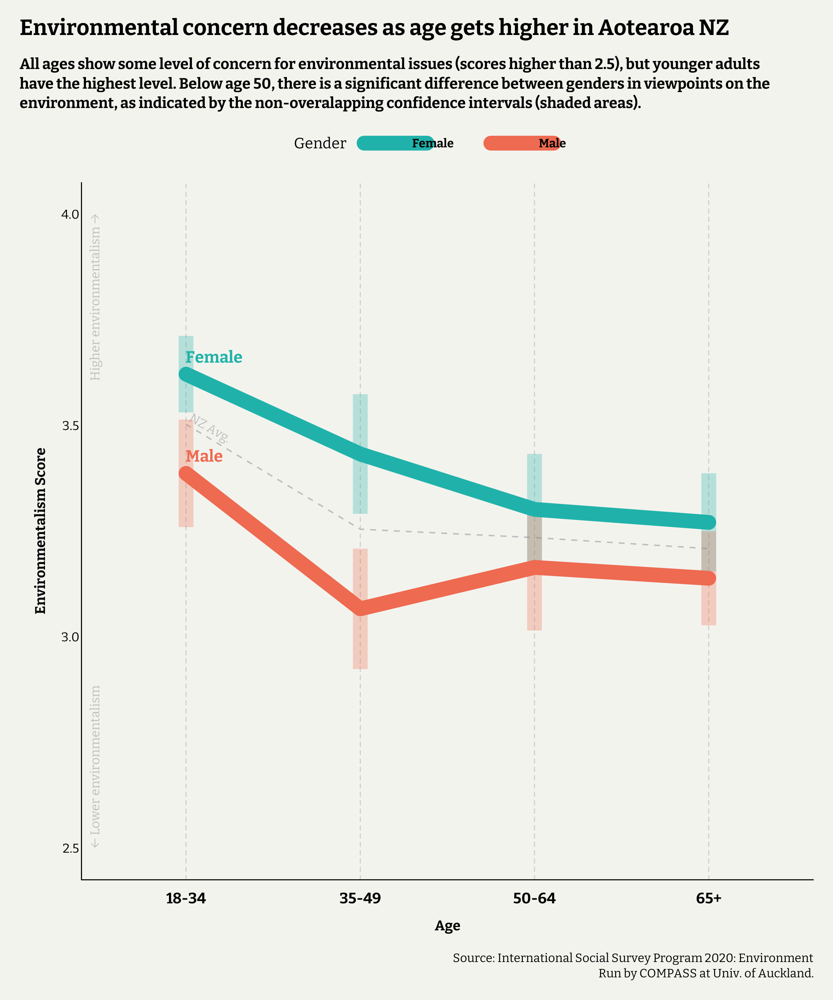
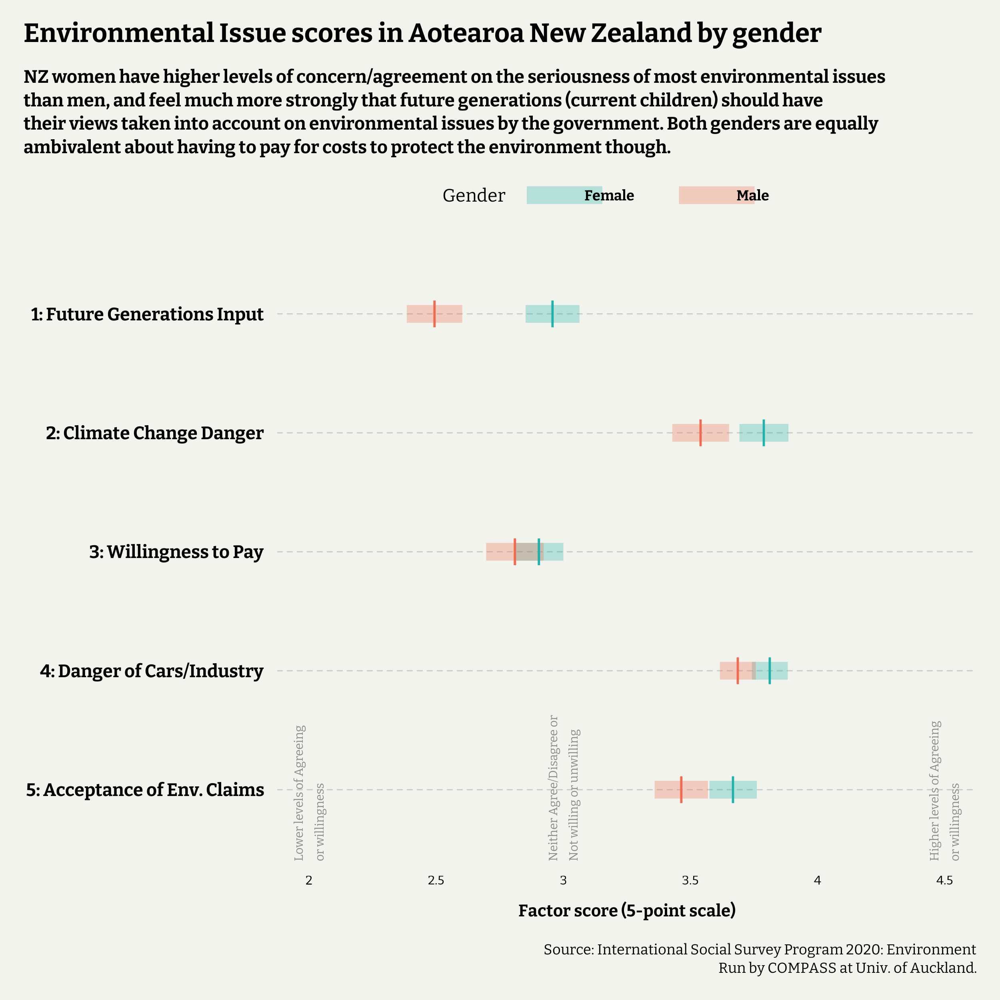

## Introduction

I am a fan of exploring survey results, and am passionate about the environment, and so when discovering the data set available from the 2020 International Social Survey Programme (ISSP) for Aotearoa was available from the University of Auckland site I had to take some time to explore it. The [ISSP surveys](https://www.auckland.ac.nz/en/arts/our-research/research-institutes-centres-groups/compass/surveys/international-social-survey-programme.html) are annual survey run cross-nationally soliciting opinions from adults on a range of salient topics, and in 2020, that topic was the environment. The fully survey data for Aotearoa is available to download, and the survey covers a range of questions on both environmental issues, and other factors that are of interest to social science researchers such as trust in political systems, political leaning, ratings of issues for New Zealand, and demographic data to help create nationally representative findings. The data used in this post, plus many years worth of data for other topics, are all available from the site linked before. The ISSP surveys are a trove of interesting data and there are a millions questions you could answer using the results of just one, let alone combining them and comparing across years where possible. I'm sure I will be using their data again at some point.

Another topic I am interested in is psychometrics, and analysing multi-dimensional data. Survey data with Likert rating scales are common but tend to report results question by question. This provides very fine granular data, but when you have a lot of questions covering similar topics reports stretch out and it can get tricky to get a simple answer to a simple question. Psychometrics, in particular factor analysis, helps by validating whether it is possible to combine answers to multiple questions to create a score representing a larger concept, or factor. A common concrete example would be a depression questionnaire -- a person answers a series of self-rated questions related to their mood and functioning and, when scored, a professional can get an overall "depression" score indicating how depressed a person is relative to an appropriate norm group. Longer ones include sub-scores, for example a 'fatigue' scale, combining answers to questions about energy levels so that a health professional can explore which areas may be causing the most problems for a depressed person.

Instead of having to create pages of graphs with results for each question, I want to do something similar with this data to answer a few key questions:

* Is it possible to create an overall *Environmentalism* (E-score) for each person in the survey to capture how important the environment is to them? Are there some sub-scores to look at different aspects of this?
* Does the importance of environmentalism change across age groups?
* Do adult men and women in Aotearoa NZ have different levels of environmentalism?

The results will be weighted to make them nationally representative in terms of age groups, gender, and primary ethnicity, using the 2018 Census results from StatsNZ. Although I won't report results by ethnicity, it's important to do this so we can feel comfortable that different groups aren't under-represented due to differing survey response rates.

## Quick summary and conclusions

The plot below shows the mean environmentalism scores for each age group, split by gender. The sample has been weighted for ethnicity. Higher environmentalism scores indicate a stronger belief in environmentalism and higher concerns about the environment. We can see a decline in older age groups, but all groups have averages above 2.5, so show some level of concern on a 5-point scale. Interestingly, gender differences in beliefs are only observable in age groups under 50, while older men and women have similar averages in environmentalism.



Across all of the sub-factors fo environmentalism created, women had higher scores on average than men, although when it comes to willingness to pay there was equal ambivalence. The lowest scores came from men regarding how important childrens' views are when considering environmental issues.

* **Future Generations Input:** How much should we care about children aged 3-14 views when creating environmental policy?
* **Climate Change Danger:** How dangerous do you think climate change is?
* **Willing to Pay:** How willing are you to pay more or sacrifice to protect the environment? 
* **Danger of Cars/Industry:** How dangerous do you think cars + industry are to the environment and us?
* **Acceptance of Environmentalism Claims:** Do you think we worry an appropriate amount about the environment?




## Methods

Let's read the data in. It comes in a .sav format (from SPSS) so needs to be read in using the `read_sav` function in the `haven` package. Each row is a person, and each column is their answer to a question. The columns have labels, so that in RStudio I can see that a column variable is called, for example, `Q&_envproblem`, but the question it is is *Here is a list of some different environmental problems. Which problem, if any, do you think is the most important for New Zealand as a whole? Please tick ONE of the following.*. The responses are also labelled, so to R they are numbers, but I can see in RStudio what the numbers mean (e.g. 1 = Air pollution, 2 = Chemicals and pesticides, etc.).

I can use these labels (stored as attributes) to quickly create a data dictionary that shows be the question id, the question itself, and the answer key to that question. The code for this is as follows.


```r
### read in data
DATA_20 <- read_sav("ISSP2020_Env.sav")

### Create a dictionary of the questions and their answer keys

DICT <- vector("list", ncol(DATA_20))


## get label information for each column
for(i in 1:ncol(DATA_20)){
  
  DICT[[i]] <- tibble(
    Q_ID = names(DATA_20)[i],
    Question = attributes(pull(DATA_20, i))$label,
    Answer_Key = attributes(pull(DATA_20, i))$labels,
    Answer_Label = attributes(pull(DATA_20, i))$labels %>% names()
  )
  
}

DICT <- bind_rows(DICT) %>%
  mutate(Q_No = str_extract(Q_ID, pattern = "(?<=Q)\\d+") %>% as.numeric())


head(DICT[50:55,])
```

```
## # A tibble: 6 × 5
##   Q_ID          Question                           Answer_Key Answer_Label  Q_No
##   <chr>         <chr>                                   <dbl> <chr>        <dbl>
## 1 Q1a_impissue1 1a: What is the most important is…          3 Crime            1
## 2 Q1a_impissue1 1a: What is the most important is…          4 The environ…     1
## 3 Q1a_impissue1 1a: What is the most important is…          5 Immigration      1
## 4 Q1a_impissue1 1a: What is the most important is…          6 The economy      1
## 5 Q1a_impissue1 1a: What is the most important is…          7 Terrorism        1
## 6 Q1a_impissue1 1a: What is the most important is…          8 Poverty          1
```

I won't recall this in code often but I can use to refer to while I'm working. One very useful thing I can do with it is quickly whittle down a list of questions that could possibly be used to create my *Environmentalism* score by taking the items from the core of the survey (non-demographic questions) that are Likert scaled. Questions 10 and 11 can also be skipped if a person answers they don't think the climate is changing in question 9 (answer key 1), so we could remove these, however, only 11 people out of 993 answered this, so we'd be scrapping a lot of potentially useful questions so we'll keep them in. Let's keep them in.


```r
## Only 11/993 respondents didn't think the climate was changing at all (1). The majority felt climate change was only due to human activity (4).

table(DATA_20$Q9_climatechange)
```

```
## 
##   1   2   3   4 
##  11  74 355 526
```


The survey is inconsistent, with some scales going 0-10, others 1-5, and a few 1-4. I can note these by looking at the max scale for each question and rescale the answers to all be on a 5-point scale. Let's also clean up the 'Don't know' responses to questions by making them missing or NA.


```r
### Identify possible questions for a psychometric

ITEMS <- DICT %>%
  filter(Q_No <= 24 & Q_No >= 2) %>%
  filter(Answer_Key >=0) %>%
  group_by(Q_ID, Question) %>%
  summarise(Scale_min = min(Answer_Key),
            Scale_max = max(Answer_Key))

### non-likert items
ITEMS <- ITEMS %>%
  filter(!Q_ID %in% c("Q7_envproblem", "Q3a_priority1", "Q3b_priority2") & Scale_max != 3 & Scale_max != 2)

## Split items up based on the Likert scale so we can move all to 1-5 scale
ITEMS_10 <- ITEMS %>% filter(Scale_max == 10)
ITEMS_4 <- ITEMS %>% filter(Scale_max == 4)
ITEMS_5 <- ITEMS %>% filter(Scale_max == 5)

## Turn all -8 responses into NA (indicates missing or 'Don't know' answers)


DATA_ENV <- bind_cols(
  
  ## Take items with 0-10 scale and rescale to 0-5
  DATA_20 %>% select(ITEMS_10$Q_ID) %>%
    mutate(across(everything(), ~.x/2)),
  
  ## Take items with 1-4 scale and rescale to 1-5
  DATA_20 %>% select(ITEMS_4$Q_ID) %>%
    mutate(across(everything(), ~.x*1.25)),
  
  ## Take items with 1-5 scale
  DATA_20 %>% select(ITEMS_5$Q_ID)
  
  
) %>%
  mutate(across(everything(), ~as.numeric(.x)))
```

Now we have a nice clean set of survey answers on (basically) the same scale. Ideally they would all start at 1, but in a *post-hoc* analysis you have to make do, and there are only a few questions that start at zero so I don't see it as an issue. We're now ready to run some factor analyses to see if there's some set of questions in here that combine to a set of factors about different aspects fo environmentalism. We're starting with 50 possible questions here, so we'll want to whittle these down a bit.

### Correlations

Underlying this is the assumption that there are sets of questions whose answers are strongly correlated to each other more than they are to other questions. Before we do a factor analysis we can view this correlation using the `corrr` package. The plot is messy but there definitely appears to be pockets of questions nicely correlated.


```r
### Checking for correlations among the items

library(corrr)


DATA_ENV %>% correlate() %>%
  shave() %>%
  rplot() +
  theme(legend.position = "top",
        axis.text.x = element_text(angle = 90))
```

}}index_files/figure-html/unnamed-chunk-5-1.png" width="1400" />

The 10 strongest correlations are below. There's overall strong correlation between the Q24 questions about how much childrens' environmental views should matter to political decisions, and how much you'd be willing to pay in taxes and in other prices generally to protect the environment, for example.


```r
DATA_ENV %>% correlate() %>%
  shave() %>%
  stretch() %>%
  filter(!is.na(r)) %>%
  slice_max(n = 10, order_by = abs(r)) %>%
  left_join(., ITEMS, by = c("x" = "Q_ID")) %>%
  rename("Question_x" = "Question") %>%
  select(-Scale_min, -Scale_max) %>%
  left_join(., ITEMS, by = c("y" = "Q_ID")) %>%
  rename("Question_y" = "Question") %>%
  select(Question_x, Question_y, r)
```

```
## # A tibble: 10 × 3
##    Question_x                                                   Question_y     r
##    <chr>                                                        <chr>      <dbl>
##  1 10a: How bad or good do you think the impacts of climate ch… 10b: How … 0.857
##  2 24a: Opinion – The views of 3 to 5 year olds should be take… 24b: Opin… 0.846
##  3 24b: Opinion – The views of 6 to 10 year olds should be tak… 24c: Opin… 0.768
##  4 24c: Opinion – The views of 11 to 14 year olds should be ta… 24d: Opin… 0.728
##  5 12a: How willing would you be to pay much higher prices to … 12b: How … 0.684
##  6 14a: How dangerous is air pollution caused by cars?          14b: How … 0.653
##  7 24a: Opinion – The views of 3 to 5 year olds should be take… 24c: Opin… 0.620
##  8 11b: Opinion – We worry too much about the future for the e… 11d: Opin… 0.593
##  9 23a: In the last year, how much has your neighbourhood been… 23b: In t… 0.588
## 10 12b: How willing would you be to pay much higher taxes to p… 12c: How … 0.551
```


```r
# Items with minimal correlations to other items

ITEMS_LowC <- DATA_ENV %>% correlate() %>%
  stretch() %>%
  filter(!is.na(r)) %>%
  group_by(x) %>%
  slice_max(order_by = abs(r), n = 1, with_ties = FALSE) %>%
  filter(r >= -0.4 & r <= 0.4) %>%
  left_join(., ITEMS, by = c("x" = "Q_ID"))

DATA_ENV_2 <- DATA_ENV %>% select(-ITEMS_LowC$x)
```

We can also remove items that don't have a high correlation with any other question to help us narrow in on the best questions quicker. It's fairly arbitrary, but let's draw a line at 0.4 and -0.4. We don't want items that don't have a correlation *r* with any other item at least this strong. This took out 14 questions, mainly todo with trade-offs between the environment and economy. There is some but not comprehensive correlations with how people's views on the importance of the economy relate to their professed environmental concerns - an area worth exploring but not in this post.


```r
ITEMS_LowC $Question
```

```
##  [1] "11a: Opinion – Modern science will solve our environmental problems with little change to our way of life"                 
##  [2] "11e: Opinion – New Zealand needs economic growth to protect the environment"                                               
##  [3] "12d: How willing would you be to accept a reduction in NZ's protected nature areas, to open them for economic development?"
##  [4] "13b: Opinion – I do what is right for the environment, even when it costs more money or takes more time"                   
##  [5] "13f: Opinion – I find it hard to know whether the way I live is helpful or harmful to the environment"                     
##  [6] "13g: Opinion – Environmental problems have a direct effect on my everyday life"                                            
##  [7] "20a: How often do you make a special effort to sort materials for recycling?"                                              
##  [8] "20b: How often do you avoid buying things for environmental reasons?"                                                      
##  [9] "2a: Opinion – Private enterprise is the best way to solve New Zealand's economic problems"                                 
## [10] "2b: Opinion – It is the responsibility of government to reduce differences in income"                                      
## [11] "2c: Opinion – We should limit the import of foreign products to protect our national economy"                              
## [12] "2d: Opinion – We should limit immigration to protect our national way of life"                                             
## [13] "2e: Opinion – International organisations take too much power from our government"                                         
## [14] "4: How much do you think you can trust people in general?"
```

### Finding the right amount of factors

Let's run the first factor analysis and explore the results to see which questions we can keep and which we can remove. the first choice we need to make is how many factors to create. There are many ways to help decide - in this instance I'll use the parallel analysis which is similar to an eigenvalue decomposition. The results are indicating there are 11 factors so let's start there. That is a lot in my opinion, so we'll be pretty ruthless about narrowing this down if we can.


```r
library(psych)
fa.parallel(DATA_ENV_2)
```

}}index_files/figure-html/unnamed-chunk-9-1.png" width="1400" />

```
## Parallel analysis suggests that the number of factors =  11  and the number of components =  8
```

Below are the loadings from the first fitted model with 11 factors. I won't explore this fit too in depth except to comment on what the make up of the factors is appearing to be. In the graph below the 11 factors are ordered by the amount of variance explained (default for the `psych` package), and only loadings greater than absolute 0.4 are shown. 

Straight away we see Q9 about belief in climate change, Q6 about overall environmental concern, and Q14d about how dangerous pollution is seen can be removed as they don't load strongly to any factor. Q8 asking for concern about marine systems is alone, so could be removed too.

There appear to be factors capturing (going from left to right) belief in value of children's environmental concerns, apathy about taking action, assessment of various environmental dangers (except nukes, GMO, and pollution), overall assessment of climate change danger, willingness to pay to protect the environment, institutional trust, lived impact of local weather events, assessment of danger of nukes and Genetically Modified Organisms, that we worry too much about the environment, and time spent in nature.

Some stand out as eligible to remove. Institutional trust isn't specifically about environmentalism, and lived impacts of weather events are more due to circumstance than opinion.


```r
model1 <- fa(DATA_ENV_2, 11)
M1_Loadings <- model1$loadings %>% unclass() %>% as_tibble(rownames = "Q_ID")

pDATA <- M1_Loadings %>%
  pivot_longer(starts_with("MR"), names_to = "Factor", values_to = "Loading") %>%
  mutate(Factor = fct_inorder(Factor)) %>%
  mutate(Loading = case_when(Loading >= 0.4 | Loading <= -0.4 ~ Loading,
                             TRUE ~ NA)
         ) 

pDATA %>%
  ggplot(aes(y = Q_ID, x = Factor, fill = Loading)) +
  geom_tile() +
  geom_label(aes(label = round(Loading, 2)), fill = "white", colour = "black", label.size = NA, alpha = 0.5) +
  scale_fill_gradientn(colours = c("firebrick4", "white", "lightseagreen"), na.value = NA, breaks = seq(-1, 1, by = 0.5), limits = c(-1, 1)) +
  labs(title = "Factor loadings for each question") +
  theme(panel.grid.major.y = element_line(linetype = "dashed", colour = "grey70"),
        legend.position = "none")
```

}}index_files/figure-html/unnamed-chunk-10-1.png" width="1400" />

At this stage, it's looking like the first 5 are the one's worth keeping as they have multiple questions loading onto them, and exclude the trust and weather events items.

It's worth remembering our end goal is a single environmentalism factor comprised of a few sub-factors that make up environmentalism. Omega is a handy function in the `psych` package that fits both a single factor and multi-factor model simultaneously to compare. I'll explore the results of this further down, but the plot it outputs shows how each question is (or isn't) loading onto the on *g* factor. This would be our Environmental score if we were to use it, and we can see that the Trust questions and the enjoying nature/leisure questions don't load strongly to it. The local weather questions don't either, reinforcing our decision to remove all of these. 

Some of the Q13 items which we are currently keeping don't load strongly to the g-factor either, so it will be interesting to see the results in a smaller factor model.


```r
## Is there a single Environment factor?
O_1 <- omega(DATA_ENV_2, nfactors = 11)
```

}}index_files/figure-html/unnamed-chunk-11-1.png" width="1400" />

## Fitting a 5-factor model

Let's take the items that load to the first 5 factors in our previous fit, and run another factor analysis. There's a bit of tidying done too to make all the scales run so that higher scores to all items would be what an environmentalist would answer.


```r
ITEMS_5 <- pDATA %>%
  filter(!is.na(Loading)) %>%
  filter(Factor %in% levels(pDATA$Factor)[1:5])

DATA_ENV_3 <- DATA_ENV %>% select(ITEMS_5$Q_ID) %>%
  mutate(across(starts_with(c("Q24", "Q14", "Q12")), ~ 6 - .x)) %>% ## reverse scoring for items to high scores reflect what concerned environmentalist would agree with
  mutate(across(starts_with("Q10"), ~ 6 - (.x + 1))) ## reverse scoring for ClimateChange assessment (+1 to account for 0 scores)

model2 <- fa(DATA_ENV_3, 5)
M2_Loadings <- model2$loadings %>% unclass() %>% as_tibble(rownames = "Q_ID")

pDATA <- M2_Loadings %>%
  pivot_longer(starts_with("MR"), names_to = "Factor", values_to = "Loading") %>%
  mutate(Factor = fct_inorder(Factor)) %>%
  mutate(Loading = case_when(Loading >= 0.4 | Loading <= -0.4 ~ Loading,
                             TRUE ~ NA)
  ) 

pDATA %>%
  ggplot(aes(y = Q_ID, x = Factor, fill = Loading)) +
  geom_tile() +
  geom_label(aes(label = round(Loading, 2)), fill = "white", colour = "black", label.size = NA, alpha = 0.5) +
  scale_fill_gradientn(colours = c("firebrick4", "white", "lightseagreen"), na.value = NA, breaks = seq(-1, 1, by = 0.5), limits = c(-1, 1)) +
  theme(panel.grid.major.y = element_line(linetype = "dashed", colour = "grey70")) +
  labs(title = "Factor loadings for each question") +
  theme(panel.grid.major.y = element_line(linetype = "dashed", colour = "grey70"),
        legend.position = "none")
```

}}index_files/figure-html/unnamed-chunk-12-1.png" width="1400" />

We've got a tidier model now with 5 factors that can be summed up (from left-to-right) as:

* **Future Generations Input:** How much should we care about childrens' views when creating environmental policy?
* **Acceptance of Environmentalism Importance:** Do you think we worry an appropriate amount about the environment? 
* **Assessment of environmental danger:** How dangerous do you think various pollutants/challenges are to the environment and us?
* **Climate Change Seriousness:** How dangerous do you think climate change is?
* **Willing to Pay:** How willing are you to pay more or sacrifice to protect the environment?

How well does this model fit? Let's look at some the factor analysis output.


```r
summary(model2)
```

```
## 
## Factor analysis with Call: fa(r = DATA_ENV_3, nfactors = 5)
## 
## Test of the hypothesis that 5 factors are sufficient.
## The degrees of freedom for the model is 86  and the objective function was  0.9 
## The number of observations was  993  with Chi Square =  883.97  with prob <  1.1e-132 
## 
## The root mean square of the residuals (RMSA) is  0.03 
## The df corrected root mean square of the residuals is  0.04 
## 
## Tucker Lewis Index of factoring reliability =  0.833
## RMSEA index =  0.097  and the 10 % confidence intervals are  0.091 0.103
## BIC =  290.5
##  With factor correlations of 
##      MR2  MR1  MR3  MR5  MR4
## MR2 1.00 0.22 0.31 0.17 0.26
## MR1 0.22 1.00 0.27 0.40 0.40
## MR3 0.31 0.27 1.00 0.39 0.32
## MR5 0.17 0.40 0.39 1.00 0.40
## MR4 0.26 0.40 0.32 0.40 1.00
```

The key information for fit here are the `\(\chi^2\)` test results, the Tucker-Lewis Index, and the RMSEA index.

The `\(\chi^2\)` test is for the hypothesis the the 5 factors alone are sufficient to explain the underlying variance in the data. With a small p-value, we reject this hypothesis, indicating this 5-factor structure isn't enough. 

The Tucker-Lewis index is 0.8330769, when we generally want higher than 0.9. For RMSEA we are looking for values below 0.08, lower than our confidence interval for it is. So the evidence is that this isn't a great fit alone.

If we were developing an actual psychometric we would use these results to further explore what we are missing and refine the survey from there. We obviously can't do this but we might be able to narrow down the questions a bit further to get a better fit. One statistic we haven't looked at is called *Uniqueness*. It is the residual variance for each item, that is, the proportion of variance for each item not explained by the 5 factors we have.

We can get these from the `fa` output below. It's fairly arbitrary but we could remove any item with less than 50% of its variance explained by the 5 factors (uniqueness values greater than 0.5). This would still leave us with 11 items connected to each of the 5 current factors while removing some questions that do not fit as tightly into this structure.


```r
sort(model2$uniquenesses)
```

```
##    Q10a_ccgoodbad  Q24b_govenv6to10 Q24c_govenv11to14  Q12b_highertaxes 
##         0.0811016         0.0874039         0.2382631         0.2395496 
##  Q10b_ccgoodbadnz    Q14b_dangerind   Q14a_dangercars   Q24a_govenv3to5 
##         0.2431112         0.3150694         0.3859530         0.3882308 
## Q12a_higherprices    Q13e_envclaims     Q11b_worryenv   Q14e_dangertemp 
##         0.3953652         0.4223818         0.4417304         0.5161452 
## Q24d_govenv15to18    Q11d_worryprog     Q13d_envpoint   Q12c_livingcuts 
##         0.5580955         0.5666355         0.5826890         0.5839311 
##   Q13a_envtoohard    Q13c_envimport   Q14c_dangerpest 
##         0.6150973         0.6242094         0.6372741
```

The results from this are below. The Tucker-Lewis Index is now 0.98, well above what we like to see. The RMSEA is also closer the level we usually look for. The `\(\chi^2\)` test results still reject the null hypothesis (that the factor structure is a perfect fit), but the chi-square result is much lower (and therefor much improved) over the previous model.


```r
## keep items with uniqueness less than 0.5, refine data set
low_U <- tibble(
  Q_ID = names(model2$uniquenesses),
  Uniq = model2$uniquenesses
) %>%
  filter(Uniq < 0.5)

DATA_ENV_4 <- DATA_ENV_3 %>%
  select(low_U$Q_ID)

## fit new factor analysis
model3 <- fa(DATA_ENV_4, nfactors = 5, fm = "ml")
summary(model3)
```

```
## 
## Factor analysis with Call: fa(r = DATA_ENV_4, nfactors = 5, fm = "ml")
## 
## Test of the hypothesis that 5 factors are sufficient.
## The degrees of freedom for the model is 10  and the objective function was  0.03 
## The number of observations was  993  with Chi Square =  28.48  with prob <  0.0015 
## 
## The root mean square of the residuals (RMSA) is  0.01 
## The df corrected root mean square of the residuals is  0.02 
## 
## Tucker Lewis Index of factoring reliability =  0.983
## RMSEA index =  0.043  and the 10 % confidence intervals are  0.025 0.062
## BIC =  -40.53
##  With factor correlations of 
##      ML2  ML1  ML3  ML4  ML5
## ML2 1.00 0.14 0.16 0.26 0.24
## ML1 0.14 1.00 0.27 0.37 0.53
## ML3 0.16 0.27 1.00 0.25 0.42
## ML4 0.26 0.37 0.25 1.00 0.37
## ML5 0.24 0.53 0.42 0.37 1.00
```

We can use omega again to get some reliability results. The plots shows that not all the items are loading onto one "g"-factor evenly.


```r
O3 <- omega(DATA_ENV_4, nfactors = 5, fm = "ml")
```

}}index_files/figure-html/unnamed-chunk-16-1.png" width="1400" />

Our alpha `\(\alpha\)` and Guttman's `\(\lambda_6\)` are okay in terms of inter-item correlation. The omega heirarchical `\(\omega_{hierarchical}\)` is the reliability just for the one general factor, while `\(\omega_{total}\)` incorporates both the general factor and the other factors.


```r
summary(O3)
```

```
## Omega 
## omega(m = DATA_ENV_4, nfactors = 5, fm = "ml")
## Alpha:                 0.83 
## G.6:                   0.9 
## Omega Hierarchical:    0.61 
## Omega H asymptotic:    0.65 
## Omega Total            0.93 
## 
## With eigenvalues of:
##    g  F1*  F2*  F3*  F4*  F5* 
## 2.68 2.05 0.98 1.04 0.98 0.37 
## The degrees of freedom for the model is 10  and the fit was  0.03 
## The number of observations was  993  with Chi Square =  28.48  with prob <  0 
## 
## The root mean square of the residuals is  0.03 
## The df corrected root mean square of the residuals is  0.12 
## 
## RMSEA and the  0.9 confidence intervals are  0.043 0.025 0.062
## BIC =  -40.53Explained Common Variance of the general factor =  0.33 
## 
##  Total, General and Subset omega for each subset
##                                                  g  F1*  F2*  F3*  F4*  F5*
## Omega total for total scores and subscales    0.93 0.91 0.93 0.85 0.79 0.72
## Omega general for total scores and subscales  0.61 0.10 0.41 0.29 0.22 0.51
## Omega group for total scores and subscales    0.28 0.81 0.52 0.57 0.57 0.21
```

A ratio of `\(\frac{\omega_{hierarchical}}{\omega_{hierarchical}}\)` close to 1 would suggest a single satisfactory factor, which we're not getting in this case. That's okay though. The five-factor structure is working well and we don't need perfection to move forward. All the items are positively correlated to a 'general' factor we could call Environmentalism.

Let's look at the final structure.


```r
M3_Loadings <- model3$loadings %>% unclass() %>% as_tibble(rownames = "Q_ID")

pDATA <- M3_Loadings %>%
  pivot_longer(starts_with("ML"), names_to = "Factor", values_to = "Loading") %>%
  mutate(Factor = fct_inorder(Factor)) %>%
  mutate(Loading = case_when(Loading >= 0.4 | Loading <= -0.4 ~ Loading,
                             TRUE ~ NA)
  ) 

pDATA %>%
  ggplot(aes(y = Q_ID, x = Factor, fill = Loading)) +
  geom_tile() +
  geom_label(aes(label = round(Loading, 2)), fill = "white", colour = "black", label.size = NA, alpha = 0.5) +
  scale_fill_gradientn(colours = c("firebrick4", "white", "lightseagreen"), na.value = NA, breaks = seq(-1, 1, by = 0.5), limits = c(-1, 1.05)) +
  theme(panel.grid.major.y = element_line(linetype = "dashed", colour = "grey70")) +
  labs(title = "Factor loadings for each question") +
  theme(panel.grid.major.y = element_line(linetype = "dashed", colour = "grey70"),
        legend.position = "none")
```

}}index_files/figure-html/unnamed-chunk-18-1.png" width="1400" />

We have, in this order:

* **Future Generations Input:** How much should we care about children aged 3-14 views when creating environmental policy?
* **Climate Change Seriousness:** How dangerous do you think climate change is?
* **Willing to Pay:** How willing are you to pay more or sacrifice to protect the environment? 
* **Assessment of environmental danger:** How dangerous do you think cars + industry are to the environment and us?
* **Acceptance of Environmentalism Importance:** Do you think we worry an appropriate amount about the environment?

### Survey weights for age-gender-ethnicity

To get nationally representative estimates for the scores we're about to calculate, we want to weight each participant to help make the sample nationally representative in terms of gender, ethnicity, and age. I won't get into details of the code, but, in short, each person is weighted so that the total sample has the same proportion of respondents from each group (e.g. Māori women aged 18-34) that is present on the national adult population based on the 2018 census.

Since people can have multiple ethnicities, for weighting we will leave individuals with the highest weight that they eligible for.


```r
### weights for age and gender for ethnicity

# Census data of ethnicity by age-gender groups for general adult population
ETHN_AGE <- read.csv("2018_census_ageEthn.csv") %>%
  filter(EthnicValue %in% c(1:6) &
           Age_in_five_year_groups_code != "total") %>%
  mutate(Age_group_code = as.numeric(Age_in_five_year_groups_code)) %>%
  filter(Age_group_code %in% c(5:18)) %>%
  mutate(Age_bin = case_when(
    Age_group_code %in% c(5:7) ~ "18-34",
    Age_group_code %in% c(8:10) ~ "35-49",
    Age_group_code %in% c(11:13) ~ "50-64",
    Age_group_code %in% c(14:18) ~ "65+"
  ))


# tidy ethnicity table by age-gender for joining to survey data
# not counting Other Ethnciity as survey sample only has 2 from this group
ETHN_AGE <- ETHN_AGE %>%
  filter(Sex_description != "Total" & Ethnic_group_description != "Other Ethnicity") %>%
  group_by(Sex_description, Age_bin, Ethnic_group_description) %>%
  summarise(n = sum(Census_usually_resident_population_count)) %>%
  ungroup() %>%
  mutate(Prop = n/sum(n)) %>% 
  ungroup() %>%
  mutate(Ethnic_group_description = case_when(
    Ethnic_group_description == "European" ~ "Euro",
    Ethnic_group_description == "Pacific Peoples" ~ "Pacific",
    Ethnic_group_description == "Māori" ~ "Maori",
    str_detect(Ethnic_group_description, "Middle Eastern") ~ "MELAA",
    TRUE ~ Ethnic_group_description
  ),
  Ethnic_group_description = str_to_upper(Ethnic_group_description)) %>%
  select(-n) %>%
  setNames(nm = c("Gender", "Age_bin", "Ethnicity", "Prop"))

##note: only 2 survey respondents are Ethn Other, so won't weight for them
DATA_weights <- DATA_20 %>%
  select(id, Q31_yearborn, Q32_gender,
         starts_with("Q34_self")) %>%
  mutate(Age = 2020 - Q31_yearborn,  ## create age bins
         Age_bin = case_when(
           Age %in% c(18:34) ~ "18-34",
           Age %in% c(15:49) ~ "35-49",
           Age %in% c(50:64) ~ "50-64",
           Age >= 65 ~ "65+",
         )) %>%
  mutate(Gender = str_to_title(Q32_gender), ## standardise gender labels
         Gender = case_when( 
           Gender == "Wahine" ~ "Female",
           Gender == "Tane" ~ "Male",
           Gender == "" ~ NA,
           TRUE ~ Gender
         )) %>%
  filter(Gender %in% c("Male", "Female") & !is.na(Age_bin)) %>% # only keep people with age and gender info
  pivot_longer(cols = starts_with("Q34"), names_to = "Ethnicity", ## get ethnicities
               values_to = "Eth_value") %>%
  mutate(Ethnicity = str_remove(Ethnicity, "^Q34_self") %>% str_to_upper(.)) %>%
  filter(Eth_value == 1)
  
attr(DATA_weights$Eth_value, "labels") <- NULL

Sample_N <- n_distinct(DATA_weights$id)

Sample_ref <- DATA_weights %>% # reference table of age + gender + ethnicity breakdown of sample population
  group_by(Gender, Age_bin, Ethnicity) %>%
  summarise(prop_sample = n_distinct(id)/Sample_N) %>%
  left_join(., ETHN_AGE) %>% # attach props of ethnicities within gender-age groups for general population
  mutate(ga_weight = Prop/prop_sample) # gender-age weight to make sample population ethnicities resemble general pop
  

## reference df of IDs and their new weight, reduce down so each individual has one weight, their highest weight
DATA_weights <- DATA_weights %>%
  left_join(., Sample_ref) %>%
  select(id, Age_bin, Gender, ga_weight) %>%
  group_by(id) %>%
  slice_max(order_by = ga_weight, n = 1, with_ties = FALSE)
```

### Putting it all together: Calculating factor scores and Environmentalism score (E-score)

Let's return to our factor model. We're not going to use it directly, but we will use the loadings to calculate factor scores for each of the 5 factors we found. Each person will have a score for each factor based on their responses the 11 items. Not every item will load onto each factor equally.


```r
# create loading weights for each factor - round to nearest 0.1 and set loadings below 0.4 to zero
LOADINGS <- M3_Loadings %>%
  pivot_longer(starts_with("ML"), values_to = "loading", names_to = "factor") %>%
  mutate(loading = round(loading, digits = 1)) %>%
  mutate(loading = ifelse(loading < 0.4, 0, loading))

# calculate factor scores for survey
F_SCORES <- DATA_ENV_4 %>%
  mutate(id = DATA_20$id) %>%
  left_join(DATA_weights, ., by = "id") %>%
  pivot_longer(starts_with("Q"), values_to = "score", names_to = "Q_ID") %>%
  left_join(., LOADINGS, by = "Q_ID", relationship = "many-to-many") %>%
  group_by(id, Age_bin, Gender, ga_weight, factor) %>%
  summarise(F_score = weighted.mean(score, w = loading, na.rm = TRUE), .groups = "drop_last")

# combine into total environment score (e-score)
E_SCORES <- F_SCORES %>%
  summarise(E_score = mean(F_score, na.rm = TRUE), .groups = "drop")
```

Let's see what this looks like. For the first person, a women over 65, her score for ML1 (Climate Change Seriousness) is 5, which is high. It drops a little for ML2 (Future Generations Input), but still high on a 5-point scale.


```r
head(F_SCORES)
```

```
## # A tibble: 6 × 6
## # Groups:   id, Age_bin, Gender, ga_weight [2]
##   id    Age_bin Gender ga_weight factor F_score
##   <chr> <chr>   <chr>      <dbl> <chr>    <dbl>
## 1 A0003 65+     Female     0.244 ML1       5   
## 2 A0003 65+     Female     0.244 ML2       3.92
## 3 A0003 65+     Female     0.244 ML3       4.62
## 4 A0003 65+     Female     0.244 ML4       5   
## 5 A0003 65+     Female     0.244 ML5       5   
## 6 A0004 65+     Male       0.656 ML1       2.5
```

That person's overall *e-score* was 4.7, indicating a high level of environmentalism. The weight shows how much her score will up-or-down valued when calculating averages. Since it's less than 1, she is from a group that was overrepresented in the sample responses (which is not unusual for older groups who tend to have higher responses rates to many surveys compared with younger people).


```r
head(E_SCORES)
```

```
## # A tibble: 6 × 5
##   id    Age_bin Gender ga_weight E_score
##   <chr> <chr>   <chr>      <dbl>   <dbl>
## 1 A0003 65+     Female     0.244    4.71
## 2 A0004 65+     Male       0.656    2.3 
## 3 A0007 65+     Male       0.656    3.50
## 4 A0012 18-34   Female     1.28     3.38
## 5 A0013 18-34   Female     0.803    3.17
## 6 A0016 65+     Female     0.771    3.13
```

Let's see how this looks at a national level and answer our first question - Does environmentalism change across age groups? We'll use the handy `srvyr` package to nicely handle calculating estimates with confidence intervals for a sample with weights, which can get convoluted very quickly.


```r
library(survey)
library(srvyr)

E_survey <- E_SCORES %>%
  as_survey_design(ids = 1,
                   weights = ga_weight,
                   strata = NULL)
pREF <- E_survey %>%
  group_by(Age_bin) %>%
  summarise(
    N = survey_total(),
    Avg = survey_mean(E_score, vartype = "ci"),
    SD = survey_sd(E_score))

gREF <- E_survey %>%
  group_by(Gender, Age_bin) %>%
  summarise(
    N = survey_total(),
    Avg = survey_mean(E_score, vartype = "ci"),
    SD = survey_sd(E_score))

gREF %>%
  ggplot(aes(x = Age_bin, colour = Gender)) +
  geom_line(data = pREF, aes(y = Avg, x = Age_bin, group = 1), linetype = "dashed", colour = "grey75", show.legend = FALSE) +
  annotate("text", x = "18-34", y = pREF$Avg[1], label = "NZ Avg.", colour = "grey75", hjust = 0, vjust = -0.5, family = "bitter", angle = -30) +
  geom_segment(aes(xend = Age_bin, y = Avg_low, yend = Avg_upp), alpha = 0.3, linewidth = 5, lineend = "butt", show.legend = FALSE) +
  geom_line(aes(y = Avg, group = Gender), linewidth = 5, lineend = "round") +
  geom_text(data = tibble(Age_bin = "18-34", y = c(gREF$Avg[1], gREF$Avg[5]), Gender = c("Female", "Male")), aes(y = y, label = Gender), hjust = 0, vjust = -1, size = 5, fontface = "bold", family = "bitter") +
  annotate("text", label = "Higher environmentalism \u2192", x = -Inf, y = 4, vjust = 2, hjust = 1, angle = 90, family = "bitter", colour = "grey75") +
  annotate("text", label = "\u2190 Lower environmentalism", x = -Inf, y = 2.5, vjust = 2, hjust = 0, angle = 90, family = "bitter", colour = "grey75") +
  scale_colour_manual(values = FM_pal) +
  scale_y_continuous(limits = c(2.5, 4)) +
  labs(
    title = "Environmental concern decreases as age gets\nhigher in Aotearoa NZ",
    subtitle = str_wrap("All ages show some level of concern for environmental issues (scores higher than 2.5), but younger adults have the highest level. 
                        Below age 50, there is a significant difference between genders in viewpoints on the environment, as indicated by the non-overalapping confidence intervals (shaded areas).", 110),
    x = "Age",
    y = "Environmentalism Score",
    caption = "Source: International Social Survey Program 2020: Environment\nRun by COMPASS at Univ. of Auckland."
  ) +
  theme(panel.grid.major.x = element_line(linetype = "dashed", colour = "grey80"),
        axis.line = element_line(),
        axis.text.x = element_text(size = 13, face = "bold", margin = margin(t = 8)))
```

}}index_files/figure-html/unnamed-chunk-23-1.png" width="1400" />

The plot above shows the mean scores for each age group, split by gender. We can see a decline in older age groups, but all groups have averages above 2.5, so show some level of concern on a 5-point scale. Interestingly, gender differences in beliefs are only observable in age groups under 50, while older men and women have similar averages in environmentalism.

Let's look at the results for the different sub factors we identified. Across all of them, women had higher scores on average than men, although when it comes to willingness to pay there was equal ambivalence. The lowest scores came from men regarding how important childrens' views are when considering environmental issues.

* **Future Generations Input:** How much should we care about children aged 3-14 views when creating environmental policy?
* **Climate Change Danger:** How dangerous do you think climate change is?
* **Willing to Pay:** How willing are you to pay more or sacrifice to protect the environment? 
* **Danger of Cars/Industry:** How dangerous do you think cars + industry are to the environment and us?
* **Acceptance of Environmentalism Claims:** Do you think we worry an appropriate amount about the environment?


```r
F_survey <- F_SCORES %>%
  as_survey_design(ids = 1,
                   weights = ga_weight,
                   strata = NULL)

F_DATA <- F_survey %>%
  group_by(Gender, factor) %>%
  summarise(
    N = survey_total(),
    Avg = survey_mean(F_score, vartype = "ci", na.rm = TRUE),
    SD = survey_sd(F_score, na.rm = TRUE)) %>%
  mutate(factor_name = case_when(
    factor == "ML1" ~ "2: Climate Change Danger",
    factor == "ML2" ~ "1: Future Generations Input",
    factor == "ML3" ~ "3: Willingness to Pay",
    factor == "ML4" ~ "4: Danger of Cars/Industry",
    factor == "ML5" ~ "5: Acceptance of Env. Claims"
  )) %>%
  select(Gender, factor_name, Avg, Avg_low, Avg_upp) 

F_DATA %>%
  pivot_wider(names_from = Gender, values_from = starts_with("Avg")) %>%
  mutate(signif = case_when(
    Avg_low_Female > Avg_upp_Male | Avg_upp_Female < Avg_low_Male ~ "*",
    TRUE ~ ""
  )) %>%
  select(factor_name, signif) %>%
  left_join(F_DATA, ., by = "factor_name") %>%
  ggplot(aes(y = factor_name, colour = Gender)) +
  geom_segment(aes(yend = factor_name, x = Avg_low, xend = Avg_upp), lineend = "butt", linewidth = 5, alpha = 0.3) +
  geom_point(aes(x = Avg), size = 7, shape = "|", show.legend = FALSE) +
  annotate("text", x = 3, y = -Inf, label = "Neither Agree/Disagree or\nNot willing or unwilling", colour = "grey55", size = 3, hjust = 0, angle = 90, family = "bitter") +
  annotate("text", x = 4.5, y = -Inf, label = "Higher levels of Agreeing\nor willingness", colour = "grey55", size = 3, hjust = 0, angle = 90, family = "bitter") +
  annotate("text", x = 2, y = -Inf, label = "Lower levels of Agreeing\nor willingness", colour = "grey55", size = 3, hjust = 0, angle = 90, family = "bitter") +
  scale_y_discrete(limits = rev) +
  scale_colour_manual(values = FM_pal) +
  scale_x_continuous(labels = seq(1, 5, by = 0.5), breaks = seq(1, 5, by = 0.5), limits = c(2,4.5)) +
  labs(
    title = "Environmental Issue scores in Aotearoa New Zealand\nby gender",
    subtitle = str_wrap("NZ women have higher levels of concern/agreement on the seriousness of most environmental issues than men, and feel much more strongly that future generations (current children) should have their views taken into account on environmental issues by the government. 
                        Both genders are equally ambivalent about having to pay for costs to protect the environment though.", 100),
    x = "Factor score (5-point scale)",
    y = NULL,
    caption = "Source: International Social Survey Program 2020: Environment\nRun by COMPASS at Univ. of Auckland."
  )+
  theme(panel.grid.major.y = element_line(linetype = "dashed", colour = "grey80"),
        axis.text.y = element_text(size = 13, face = "bold", margin = margin(r = 8)),
        axis.text.x = element_text(margin = margin(t = 8))
        )
```

}}index_files/figure-html/unnamed-chunk-24-1.png" width="1400" />


```r
E_survey_pol <- E_SCORES %>%
  left_join(., select(DATA_20, id, Q45_leftright)) %>%
  filter(Q45_leftright > 0 & !is.na(Q45_leftright)) %>%
  mutate(Pol_Lean = case_when(
    Q45_leftright <= 2 ~ "Far-Left",
    Q45_leftright > 2 & Q45_leftright < 5 ~ "Centre-Left",
    Q45_leftright == 5 ~ "Centrist",
    Q45_leftright > 5 & Q45_leftright < 8 ~ "Centre-Right",
    Q45_leftright >= 8 ~ "Far-Right"
  )) %>%
  as_survey_design(ids = 1,
                   weights = ga_weight,
                   strata = NULL)


pREF <- E_survey_pol %>%
  group_by(Gender, Pol_Lean) %>%
  summarise(
    N = survey_total(),
    Avg = survey_mean(E_score, vartype = "ci"),
    SD = survey_sd(E_score)) %>%
  mutate(Pol_Lean = factor(Pol_Lean, levels = c("Far-Left", "Centre-Left", "Centrist", "Centre-Right", "Far-Right")))

pREF %>%
  ggplot(aes(x = Pol_Lean, colour = Gender)) +
  geom_segment(aes(xend = Pol_Lean, y = Avg_low, yend = Avg_upp), alpha = 0.3, linewidth = 5, lineend = "butt", show.legend = FALSE) +
  geom_line(aes(y = Avg, group = Gender), linewidth = 5, lineend = "round") +
  geom_text(data = tibble(Pol_Lean = "Far-Left", y = c(pREF$Avg[4], gREF$Avg[9]), Gender = c("Female", "Male")), aes(y = y, label = Gender), hjust = 0, vjust = -1, size = 5, fontface = "bold", family = "bitter") +
  annotate("text", label = "Higher environmentalism \u2192", x = -Inf, y = 4.2, vjust = 2, hjust = 1, angle = 90, family = "bitter", colour = "grey75") +
  annotate("text", label = "\u2190 Lower environmentalism", x = -Inf, y = 2.5, vjust = 2, hjust = 0, angle = 90, family = "bitter", colour = "grey75") +
  scale_colour_manual(values = FM_pal) +
  scale_y_continuous(limits = c(2.5, 4.2)) +
  labs(
    title = "Environmental concern decreases as people get more\nright-wing in Aotearoa NZ",
    subtitle = str_wrap("All groups show some level of concern for environmental issues (scores higher than 2.5), but far-left adults have the highest level. 
                        There isn't much difference between genders within each political group.", 70),
    x = "Political Leaning (Self-Identified)",
    y = "Environmentalism Score",
    caption = "Source: International Social Survey Program 2020: Environment\nRun by COMPASS at Univ. of Auckland."
  ) +
  theme(panel.grid.major.x = element_line(linetype = "dashed", colour = "grey80"),
        axis.line = element_line(),
        axis.text.x = element_text(size = 13, face = "bold", margin = margin(t = 8)))
```

}}index_files/figure-html/unnamed-chunk-25-1.png" width="1400" />


```r
## Do E-scores relate to whether someone identified the Environment as one their Top 2 Issues for NZ?

E_SCORES %>%
  left_join(., select(DATA_20, id, matches("^Q1[[:alpha:]]_"))) %>%
  mutate(across( matches("^Q1[[:alpha:]]_"), ~ifelse(.x < 0, NA, .x))) %>%
  mutate(Env_Issue = case_when(
    Q1a_impissue1 == 4 | Q1b_impissue2 == 4 ~ "Yes",
    TRUE ~ "No"
  )) %>%
  as_survey_design(ids = 1,
                   weights = ga_weight,
                   strata = NULL) %>%
  group_by(Env_Issue) %>%
  summarise(N_wt = survey_total(),
            Avg_Escore = survey_mean(E_score, vartype = "ci"))
```

```
## # A tibble: 2 × 6
##   Env_Issue  N_wt N_wt_se Avg_Escore Avg_Escore_low Avg_Escore_upp
##   <chr>     <dbl>   <dbl>      <dbl>          <dbl>          <dbl>
## 1 No         574.    15.7       3.17           3.11           3.22
## 2 Yes        268.    14.1       3.62           3.55           3.69
```


```r
## Do E-scores relate to how often someone spends time in nature?

E_SCORES %>%
  left_join(., select(DATA_20, id, Q17_leisure)) %>%
  filter(Q17_leisure > 0 & !is.na(Q17_leisure)) %>%
  mutate(Leisure = case_when(
    Q17_leisure == 1 ~ "Daily",
    Q17_leisure == 2 ~ "Weekly",
    Q17_leisure == 3 ~ "Monthly",
    Q17_leisure == 4 ~ "Yearly",
    Q17_leisure == 5 ~ "Never"
  )) %>%
  as_survey_design(ids = 1,
                   weights = ga_weight,
                   strata = NULL) %>%
  group_by(Leisure) %>%
  summarise(N_wt = survey_total(),
            Avg_Escore = survey_mean(E_score, vartype = "ci"))
```

```
## # A tibble: 5 × 6
##   Leisure  N_wt N_wt_se Avg_Escore Avg_Escore_low Avg_Escore_upp
##   <chr>   <dbl>   <dbl>      <dbl>          <dbl>          <dbl>
## 1 Daily   172.    12.3        3.31           3.19           3.42
## 2 Monthly 212.    13.0        3.33           3.22           3.43
## 3 Never    20.7    4.44       3.40           3.15           3.65
## 4 Weekly  298.    14.6        3.36           3.29           3.43
## 5 Yearly  136.    11.0        3.19           3.08           3.29
```


```r
E_SCORES %>%
  left_join(., select(DATA_20, id, Q16_enjoynature)) %>%
  filter(Q16_enjoynature > 0 & !is.na(Q16_enjoynature)) %>%
  as_survey_design(ids = 1,
                   weights = ga_weight,
                   strata = NULL) %>%
  group_by(Q16_enjoynature) %>%
  summarise(N_wt = survey_total(),
            Avg_Escore = survey_mean(E_score, vartype = "ci"))
```

```
## # A tibble: 5 × 6
##   Q16_enjoynature          N_wt N_wt_se Avg_Escore Avg_Escore_low Avg_Escore_upp
##   <dbl+lbl>               <dbl>   <dbl>      <dbl>          <dbl>          <dbl>
## 1 1 [Not at all]           4.73    2.02       3.47           3.13           3.81
## 2 2 [To a small extent]   11.7     3.43       3.17           2.70           3.64
## 3 3 [To some extent]     132.     10.6        3.06           2.94           3.17
## 4 4 [To a great extent]  327.     14.7        3.28           3.21           3.35
## 5 5 [To a very great ex… 365.     15.9        3.43           3.36           3.51
```

